# PetFolio Full-App Material 3 Adaptive Redesign Plan

## Evidence base (what we trust)

**Validated PetFolio UI** (use for critique/redesign):
- Inventory pass: [`docs/automation/petfolio_android_automation_inventory_2026-05-25.md`](docs/automation/petfolio_android_automation_inventory_2026-05-25.md)
- Fresh pass: [`docs/automation/fresh_2026-05-25_automation/fresh_start_testing_report.md`](docs/automation/fresh_2026-05-25_automation/fresh_start_testing_report.md)
- UI dumps under [`docs/automation/ui-dumps/`](docs/automation/ui-dumps/) and [`docs/automation/fresh_2026-05-25_automation/ui-dumps/`](docs/automation/fresh_2026-05-25_automation/ui-dumps/)

**Invalid / do not use as PetFolio UI** (per fresh report): `010_notifications_screen.png`, `012_social_profile_from_avatar.png`, `013_home_after_social_profile.png`, launcher ANR block `074–083_*`, wrong-route relaunches `034/040/043/050/052–054`, and contaminated `098–100_*`. Legacy mislabels: `025_care_nutrition_screen.png`, `026_care_medical_vault_screen.png` → use `087_*`, `089_*`.

**Code baseline**: M3 already enabled in [`lib/core/theme/app_theme.dart`](lib/core/theme/app_theme.dart), unified shell header in [`lib/core/widgets/app_header.dart`](lib/core/widgets/app_header.dart), adaptive shell at 600dp in [`lib/core/router.dart`](lib/core/router.dart) (`AppShell`).

Screenshots could not be opened in this environment (permission); observations below come from **UI dump summaries/XML** and automation reports (high confidence for layout hierarchy; color/spacing judgments marked where assumed).

---

## 1. Executive summary — current UX problems

### Confirmed (from dumps/reports)

| Problem | Impact |
|--------|--------|
| **Care streak hero dominates viewport** (~1079px tall on 2424px screen in care dumps) | Pushes daily tasks below fold; weak scanability for primary action (complete tasks) |
| **Inconsistent top chrome** | Shell tabs use `AppHeader`; seller/admin use bespoke bars → breaks “one app” mental model |
| **Shell icon collision** | Care and Match both use heart-family icons in [`AppShell`](lib/core/router.dart) | Wayfinding confusion between health care vs matching |
| **Eyebrow vocabulary drift** | `ACTIVE PET`, `CARE · PET`, `PACK`, `MATCH · NEARBY`, `MARKET · SHOP` | Brand cohesion suffers; screen context harder to parse |
| **Matching deck density** | Candidate card stacks species/breed/traits/distance in one scrollable block (fresh `091_*` dump) | Hard to compare pets; CTAs compete with metadata |
| **Marketplace product detail layout** | Content starts ~y=930 with only back chip (`064_*` dump) | Weak product hierarchy; hero image/title not anchored in a standard app bar |
| **Admin is single-scroll overview only** | Tabs (KYC/orders/moderation/shops) not captured reliably | Ops workflows likely phone-only lists without tablet split panes |
| **Automation gaps** | No clean captures for login/register/onboarding, checkout, buyer orders, chat thread, admin tabs, notifications | Redesign must prototype these from code + retest |

### Assumed (needs visual confirmation on device)

- Glass/blur cards may reduce contrast on `surface1` backgrounds in bright outdoor mode
- Some trailing header chips may be &lt;48dp (bounds ~116×115 in dumps — close but menu/check affordances need audit)
- Feed “0 likes / 0 comments” presentation may feel broken vs “Be first to react”

### Strengths to preserve

- **Active-pet-first model** (avatar + switcher + eyebrow) is distinctive and correct for multi-pet households
- **Pillar color system** already maps features (social/match/health/market) in [`app_colors.dart`](lib/core/theme/app_colors.dart)
- **Real data surfaces** (care tasks, feed posts, discovery candidates, marketplace catalog) — redesign is visual/IA, not feature removal
- **Stable automation keys** (`shell_nav__*`, `app_header_*`, `care_task_*`) — keep and extend for QA

---

## 2. Screen inventory (validated captures)

```mermaid
flowchart TB
  subgraph shell [Shell Tabs]
    Home["/home Pets"]
    Care["/care"]
    Social["/social"]
    Match["/matching"]
    Market["/marketplace"]
  end
  subgraph homeFlows [Home / Pet Profile]
    Home --> ProfileTabs["Overview Health Care Awards"]
    Home --> PetSwitcher["Pet Switcher Sheet"]
    Home --> ManagePets["/pets/manage"]
    Home --> SocialProf["/social/profile/:petId"]
  end
  subgraph careFlows [Care]
    Care --> CareDash["Streak Date Tasks AI"]
    Care --> Nutrition["/care/nutrition"]
    Care --> MedVault["/care/medical-vault"]
    Care --> AddTask["Add Task Sheet"]
  end
  subgraph socialFlows [Social]
    Social --> Feed["Stories + Posts"]
    Social --> CreatePost["/social/create"]
    Social --> Notif["/social/notifications MISSING CLEAN"]
  end
  subgraph matchFlows [Matching]
    Match --> Discovery["Deck or Empty"]
    Match --> Prefs["Filter Sheet"]
    Match --> Inbox["/matching/inbox"]
    Match --> Chat["/matching/chat/:id MISSING"]
  end
  subgraph commerce [Commerce]
    Market --> Product["product detail GAP"]
    Market --> Cart["cart empty VALID"]
    Market --> Shop["/shop/:id GAP"]
    Market --> Seller["/seller"]
    Market --> Admin["/admin"]
  end
```



| Module | Valid screenshots (representative) | Key UI elements observed |
|--------|-----------------------------------|---------------------------|
| Home | `001_fresh`, `002–006`, `007`, `008` | Health streak, stat grid, profile tabs, social/seller CTAs |
| Care | `021–023`, `087`, `089`, `023–024` | Streak ring, date strip, tasks, AI refresh, banners, sheets |
| Social | `030–031`, `032/061 create post`, `072 messages→inbox` | Stories, post cards, Post FAB, create post form |
| Matching | `091`, `092`, `094`, `040 empty` | Deck/empty, filters, inbox new matches + threads |
| Marketplace | `050–051`, `095–096`, `052 cart`, `064 detail`, `066 storefront` | Search, categories, shops carousel, subscriptions, PDP |
| Seller | `056–057`, `069–070` | Shop card, metrics, quick actions, danger zone |
| Admin | `060`, `072` | Platform metrics, recent activity list |

**Not captured (implement from code + second pass):** login, register, onboarding, checkout, order confirmation, buyer orders, chat UI, admin tab bodies, KYC forms, Stripe onboarding WebView, post detail/comments, match celebration overlay.

---

## 3. Repeated components (audit)

| Component | Where it appears | Redesign direction |
|-----------|------------------|-------------------|
| `AppHeader` | Home, Care, Social, Match, Market | Keep; standardize eyebrows + pillar tint strip |
| Pet switcher sheet | All shell tabs | Extract `PetSwitcherSheet` design system widget |
| Bottom nav / rail | `AppShell` | Distinct icons; add `NavigationBar` labels; expanded → drawer option for ops |
| Profile stat grid | Home overview | Compact `PetStatGrid` with 2×2 → 4-col on medium+ |
| Care streak ring | Care top | Shrink on phone; expandable detail sheet on tap |
| Date strip | Care | Use `DatePicker`/`CalendarDatePicker` pattern or M3 `DatePickerDialog` chip row with 48dp cells |
| Task rows | Care | `CareTaskCard` with swipe + 48dp trailing actions |
| Resource banners | Care bottom | `CareResourceBanner` (nutrition/vault) — horizontal on tablet |
| Feed post card | Social | `FeedPostCard` with clear action bar |
| Match candidate | Matching | `MatchCandidateCard` + fixed bottom action dock |
| Product/shop cards | Market | `ProductCard`, `ShopCard` with consistent price/subscription chip |
| Seller quick actions | Seller | Convert list tiles to `ListSection` + icons |
| Admin metric glass cards | Admin | `AdminMetricCard` grid (2×2 phone, 4×1 tablet) |
| Empty states | Cart, med vault, matching | Unified `PetfolioEmptyState` + illustration slot |
| Forms | Auth, create post, KYC | `PetfolioFormSection` + inline validation |

---

## 4. Material 3 adaptive layout strategy

### Breakpoints (align M3 window size classes)

| Token | Width | Navigation | Content max width |
|-------|-------|------------|-------------------|
| `compact` | &lt;600dp | `NavigationBar` | full bleed with 16dp horizontal padding |
| `medium` | 600–839dp | `NavigationRail` (existing) | 720dp centered content column optional |
| `expanded` | 840–1199dp | `NavigationRail` + optional **secondary rail** for sub-nav | 840dp content + side pane |
| `large` | ≥1200dp | `NavigationDrawer` (permanent) for shell; list-detail for ops | 960–1040dp |

Implement via `LayoutBuilder` + shared `PetfolioBreakpoints` in `lib/core/layout/` (new), mirroring [Flutter adaptive guidance](https://docs.flutter.dev/ui/adaptive-responsive) and [canonical list-detail layouts](https://developer.android.com/develop/ui/compose/layouts/adaptive/list-detail).

### Canonical layouts per feature

| Feature | Compact phone | Medium tablet | Expanded / desktop |
|---------|---------------|---------------|-------------------|
| Home profile | Single column + tabs | Tabs + 2-column overview (stats + feed preview) | Drawer + overview + detail column for tab content |
| Care | Streak compact + tasks | Streak beside task list (2-column) | Supporting pane: selected day detail |
| Social feed | Single column | Feed + optional post preview pane | Feed + post detail split |
| Matching inbox/chat | Inbox OR chat | **List-detail** ([list-detail guide](https://developer.android.com/develop/adaptive-apps/guides/list-detail)) | Same + wider chat composer |
| Marketplace | 2-col product grid | 3-col grid + filter side sheet | Grid + permanent category rail |
| Seller/admin orders | List → detail push | List-detail | List-detail + summary header |
| Checkout | Single column stepped | Centered 480dp form column | Same + order summary sticky panel |

### Foldable / landscape

- **Tabletop posture**: keep bottom nav per [NavigationSuiteScaffold defaults](https://developer.android.com/develop/ui/compose/layouts/adaptive/build-adaptive-navigation) (bar when height compact).
- **Dual-pane**: use hinge-aware `OrientationBuilder` only where needed; prefer width breakpoints first.

### Flutter packages (prefer official)

- Evaluate `flutter_adaptive_scaffold` for shell ([package docs](https://pub.dev/packages/flutter_adaptive_scaffold)) vs extending current `AppShell`.
- For list-detail in Flutter: custom `Row` + `AnimatedSwitcher` at ≥840dp (no Compose scaffold, but same IA).

---

## 5. Design system proposal (PetFolio DS)

**Foundation already exists** — extend, do not replace:

### Color

- **Primary**: `blue500` (brand trust)
- **Pillar accents** (feature identity): `sunset500` social, `coral500` match, `meadow500` health/care, `apricot500` market — use as *container tints* (8–12% alpha on `surface1`), not full backgrounds
- **Semantic**: keep `success/warning/danger/info` from [`app_colors.dart`](lib/core/theme/app_colors.dart)
- **Contrast**: target WCAG AA for body text on `surface0/1`; primary buttons white on `blue500` (verify dark mode `blue500D`)

### Typography

- Keep **Sora** (display/headline/title) + **Inter** (body/label) mapping in `AppTheme._textTheme`
- Add `TextTheme` scale multipliers via `MediaQuery.textScaler` clamp (max 1.3) for layout stability
- Section labels: `labelSmall` overline style (already 11sp w600) for eyebrows

### Shape / elevation

- Cards: `radiusLg` (16) default; sheets: `radius2xl` (28) top corners
- Reduce default **glass** usage → reserve `GlassCard` for hero metrics only (streak, admin KPIs)
- Elevation: tonal surfaces per [M3 elevation guidance](https://developer.android.com/develop/ui/compose/designsystems/material3); use `surfaceContainerHigh` for elevated cards

### Spacing scale (extend `AppThemeSpacing`)

| Token | dp | Usage |
|-------|-----|--------|
| xs | 4 | icon-text gap |
| sm | 8 | inline chips |
| md | 12 | card internal |
| lg | 16 | screen horizontal |
| xl | 24 | section gap |
| 2xl | 32 | hero padding |

### Core components (new `lib/core/widgets/ds/`)

| Widget | M3 base | Notes |
|--------|---------|-------|
| `PfAppHeader` | wrap `AppHeader` | Pillar tint + mandatory semantics |
| `PfPetAvatar` | wrap `PetAvatar` | sizes: 40/56/72 |
| `PfPrimaryButton` | `FilledButton` | min height 52, min width 120 |
| `PfSecondaryButton` | `OutlinedButton` | |
| `PfDestructiveButton` | `FilledButton` + `error` | Requires confirmation dialog |
| `PfBottomSheet` | `showModalBottomSheet` + `DraggableScrollableSheet` | Standard handle, title, actions |
| `PfDialog` | `AlertDialog` | Destructive uses `errorContainer` title |
| `PfEmptyState` | extend `PetfolioEmptyState` | icon + title + body + CTA |
| `PfSkeleton` | `SkeletonLoader` | Match card geometries |
| `PfSectionHeader` | `ListTile` style | Title + optional action |
| `PfFilterChips` | `FilterChip` / `ChoiceChip` | Marketplace + match prefs |
| `PfStatCard` | `Card` | Home/admin metrics |
| `PfProductCard` | `Card` | 1:1 image ratio option |
| `PfFeedPostCard` | `Card` | 4:5 media ratio |
| `PfCareTaskCard` | `Dismissible` + `Checkbox` | Swipe complete |
| `PfMatchActionBar` | `BottomAppBar` or docked `Row` | Pass/Greet/Like/Super |

---

## 6. Navigation model

### Compact (&lt;600dp)

- **Primary**: existing 5-tab `NavigationBar` — relabel internally: `Home`, `Care`, `Social`, `Match`, `Shop` (user-facing strings can stay “Pets/Market”)
- **Icons**: unique per tab (e.g. `pets`, `medical_services` or `favorite` for care, `people`, `swipe` or `pets` for match, `storefront`)
- **FAB rules**: one FAB per tab max (Care add task, Social create post) — coordinate with `Scaffold.floatingActionButtonLocation`
- **Full-screen routes**: product, cart, seller, admin, nutrition, vault — hide bottom nav (already outside shell)

### Medium (600–839dp)

- **NavigationRail** extended with **trailing slot**: avatar → switcher; bottom: seller/admin shortcuts if role allows
- Content gets `SafeArea` + 24dp padding

### Expanded (≥840dp)

- **Permanent `NavigationDrawer`** (240dp) for shell destinations + “Seller” / “Admin” entries when authorized
- **Secondary navigation** inside feature:
  - Admin: vertical `NavigationDrawer` tabs (Dashboard, KYC, Orders, Moderation, Ledger, Shops)
  - Seller: Setup | Products | Orders | Settings
  - Matching: Discover | Inbox

### Deep links

Preserve GoRouter paths from inventory; adaptive panes only change *presentation*, not routes.

---

## 7. Screen-by-screen redesign recommendations

### Auth and onboarding (code-based; no valid screenshots)

- **Login/Register**: single-column centered card (max 400dp wide on tablet); brand mark + “PetFolio” wordmark; fields with persistent labels ([Stripe form guidance](https://stripe.com/resources/more/mobile-checkout-ui))
- **Progress**: `Stepper` or `LinearProgressIndicator` on onboarding (pet name → species → photo → discoverability)
- **Validation**: inline `errorText` on blur; primary CTA disabled until valid (not only on submit)
- **Completion**: full-screen success with illustration + “Go to Care” CTA

### Home / Pet Profile

- **Header**: keep `ACTIVE PET` eyebrow; add subtle `meadow` pillar underline
- **Health streak**: reduce to 120–160dp ring on phone; tap opens bottom sheet with 28-day chart
- **Stat grid**: icon + label + value; equal column widths; skeleton while loading
- **Tabs**: migrate to `TabBar` + `TabBarView` with `TabAlignment.start` and scrollable tabs on narrow phones
- **CTAs**: `View Social Profile` → tonal button; `Seller Dashboard` → `ListTile` with shop status chip (not “Loading shop…” inline text)
- **Overview sections**: `UPCOMING CARE` / `SOCIAL` as `PfSectionHeader` + horizontal cards on medium+

### Care dashboard

- **Layout order (phone)**: compact streak summary (72dp) → date strip → “Today’s tasks” header → task list → resource banners
- **Streak ring**: outer ring = streak days; inner = today completion; center numeric `5/12` with `headlineSmall`
- **Date strip**: 48×48dp cells; selected day uses `primaryContainer`
- **Tasks**: leading checkbox 48dp; swipe reveals complete; overflow menu → `ModalBottomSheet` (edit/delete)
- **AI routine**: `TonalButton` “Refresh AI routine” with loading indicator in-button
- **Banners**: split nutrition (meadow) / vault (blue-info) with chevron; side-by-side on ≥600dp

### Nutrition

- **App bar**: `PfAppHeader` or `SliverAppBar` with pet name
- **Weight trend**: card with chart height 200dp; empty state CTA “Log first weight”
- **Calorie card**: MER breakdown collapsible (`ExpansionTile`)
- **Log weight**: extended FAB → bottom sheet form (weight, date, note) — not full-screen unless tablet

### Medical Vault

- **Sections**: `TabBar` or `SegmentedButton` for Vaccines | Meds | Vet visits
- **Empty**: illustration per section + “Add record” (not three identical text blocks)
- **Add flow**: multi-step sheet: type → details → optional document (`file_picker` hint)

### Social

- **Header eyebrow**: rename `PACK` → `SOCIAL` (or “PACK” tooltip: your pet pack)
- **Stories**: circular avatars 64dp, gradient ring for unseen
- **Feed card**: author row 48dp tap target; media 4:5; action row (like, comment, share, report) min 48dp; show “Be the first to like” when 0
- **Create post**: sticky footer with `Share` `FilledButton`; disabled state uses `onSurfaceVariant` + helper text
- **Post detail / comments**: standard push; composer pinned above keyboard

### Matching

- **Discovery**: card height max 62% viewport; photo top 45%; metadata chips max 2 lines then “+N”
- **Action dock**: fixed bottom glass-safe dock; 56dp circular buttons; labels on long-press
- **Empty state**: illustration + 2-step checklist (discoverability + location) + deep link to edit pet
- **Filters sheet**: `DraggableScrollableSheet` initial 0.6; species `FilterChip`; sliders with value labels
- **Inbox**: segmented New matches | Messages; list-detail ≥840dp
- **Chat**: `ListView` + composer; bubble max width 78%; match celebration → full-screen overlay with reduce-motion fade option

### Marketplace

- **Home**: search `SearchBar` (M3); category chips sticky under header; shops `CarouselView` height 120dp
- **Subscription row**: badge `Subscribe & Save` using `apricot` container
- **Product grid**: 2 col phone, 3 col medium, 4 col expanded; consistent image aspect 1:1
- **PDP**: `CustomScrollView` + `SliverAppBar` (image 360dp) → title/price → frequency chips → quantity stepper → sticky `bottomNavigationBar` CTA
- **Cart**: empty state + “Browse marketplace”; multi-shop sections with per-shop checkout CTA
- **Checkout**: 3 steps (Address → Review → Pay); order summary collapsible on phone; Stripe Payment Element full width ([Payment Element docs](https://docs.stripe.com/payments/payment-element))

### Seller

- **Unify header** with `PfAppHeader` eyebrow `SELLER` or reuse shell when deep-linking from home
- **Dashboard**: KPI row 2 cards; quick actions as `Card` grid on tablet
- **KYC**: document upload tiles with status chips; progress indicator
- **Products/orders**: list-detail on expanded; destructive actions behind dialog + type-to-confirm for shop deletion

### Admin

- **Shell**: drawer tabs on expanded; `TabBar` on phone
- **Dashboard**: metric cards with sparkline placeholder; activity feed as `ListTile` with relative time
- **Queues (KYC, moderation, deletions)**: filter chips + swipe actions disabled; primary action = review sheet
- **Destructive**: `AlertDialog` + confirm label matching action (“Reject KYC”)

---

## 8. Screenshot critique table (valid captures only)

Priority: **P0** ship-blocker UX, **P1** high impact, **P2** polish.

| File | Feature | Observed issues (confirmed) | Redesign recommendation | Priority |
|------|---------|----------------------------|-------------------------|----------|
| `001_fresh_launch_initial` | Home | Streak + tabs compete for vertical space | Compact streak; sticky tab bar below header | P1 |
| `002–003` home overview | Home | Dense scroll; seller CTA shows loading copy in dump | Section cards; resolved shop status chip | P1 |
| `004–006` profile tabs | Home | Tab bar at y≈1525 (low) | Move tabs under header; content scroll per tab | P1 |
| `007` pet switcher | Global | Sheet OK; sign-out at bottom | Add search when &gt;5 pets; haptic on switch | P2 |
| `008` manage pets | Pets | List-only | Add pet row prominence; swipe actions QA-only | P2 |
| `020–022` care | Care | Streak ~50% screen | Compact streak + sheet detail | P0 |
| `023–024` add task sheet | Care | Sheet present | Standard `PfBottomSheet` + keyboard padding | P1 |
| `087` nutrition | Care | Chart + MER + history in one scroll | Section tabs; FAB log weight | P1 |
| `089` med vault | Care | Three repetitive empty blocks | Segmented sections + distinct empty art | P1 |
| `030–031` social feed | Social | `PACK` label; zero engagement | Rename eyebrow; empathetic zero states | P1 |
| `032/061` create post | Social | Share disabled until content | Helper text; progressive enable | P1 |
| `040` matching empty | Match | Long guidance text | Checklist + primary CTA to settings | P1 |
| `091` matching deck | Match | Metadata overload | Card template + docked actions | P0 |
| `092` filters | Match | Sheet | Draggable sheet + chip/slider layout | P2 |
| `094` inbox | Match | Header duplicate avatar nodes | Clean list tiles; list-detail tablet | P1 |
| `050–051/095–096` marketplace | Market | Many horizontal scroll regions | Sticky search/filters; grid below fold | P1 |
| `052` cart empty | Market | Generic empty | Category shortcuts + recent shops | P2 |
| `064` product detail | Market | Late content offset | `SliverAppBar` product hero | P0 |
| `066/082` storefront | Market | Grid of products | Shop header banner + filter | P1 |
| `056–057/069–070` seller | Seller | Different header pattern | Unify `PfAppHeader`; danger zone isolation | P1 |
| `060/072` admin | Admin | No tab bodies captured | Drawer tabs + list-detail queues | P0 |

**Invalid rows (skip):** all files listed in fresh report § “Invalid or Contaminated Captures”.

---

## 9. Additional screenshots / flows needed

| Flow | Why |
|------|-----|
| Login, register, forgot password | No capture; form UX unverified |
| Onboarding + add pet | Multi-step validation states |
| Checkout + order confirmation | Commerce critical path |
| Buyer order history | Post-purchase UX |
| Chat thread + message send | Matching completion loop |
| Match celebration overlay | Motion/accessibility |
| Admin: KYC, orders, moderation, shops tabs | Tab targeting failed |
| Notifications screen | Contaminated prior capture |
| Social post detail + comments | Engagement loop |
| Stripe onboarding WebView | Seller setup |
| Landscape + 7" tablet + foldable half-open | Adaptive verification |
| Dark mode parity | Theme extension coverage |

**Recommendation:** Marionette/`integration_test` route harness (per fresh report) with `resetRoute()` between captures.

---

## 10. Flutter implementation guidance

### New modules (feature-first preserved)

```
lib/core/
  layout/petfolio_breakpoints.dart
  layout/petfolio_adaptive_scaffold.dart   // optional wrapper
  widgets/ds/                              // design system primitives
lib/features/*/presentation/widgets/     // feature-specific compositions
```

### Layout primitives

- `LayoutBuilder` for breakpoint switches ([Flutter adaptive docs](https://docs.flutter.dev/ui/adaptive-responsive))
- `CustomScrollView` + slivers for feed/market/care
- `NavigationDrawer` + `NavigationRail` + `NavigationBar` triad in `AppShell`
- Master-detail: `Row(children: [SizedBox(width: 360, child: list), Expanded(child: detail)])` when `width >= 840`

### M3 widgets to prefer

`NavigationBar`, `NavigationRail`, `NavigationDrawer`, `SearchBar`, `FilterChip`, `SegmentedButton`, `FilledButton`, `FilledButton.tonal`, `Card`, `ListTile`, `ModalBottomSheet`, `AlertDialog`, `Badge`, `LinearProgressIndicator`, `DatePickerDialog`, `TabBar` (secondary)

### State / UI coupling (Riverpod)

- Keep existing providers; add **UI-only** providers sparingly: `selectedInboxThreadIdProvider` for split-pane matching; `adminSectionIndexProvider` for admin drawer
- Do **not** set long-lived `AsyncValue.error` for snackbar-worthy failures (per AGENTS.md)
- Active pet changes should invalidate care/social/match headers via existing `activePetIdProvider`

### Keys for automation

Extend pattern: `shell_nav__*`, `pf_header_switcher`, `pf_task_check_<id>`, `pf_match_pass`, `admin_tab_kyc`, etc.

---

## 11. Prioritized implementation roadmap

### Phase 1 — Global theme and shared components (2–3 weeks)

- Add `PetfolioBreakpoints`, spacing tokens, DS widgets (`Pf*`)
- Tone down default `GlassCard` usage; document when to use glass vs solid
- Dark mode audit on pillar containers
- **Exit:** Storybook/widget tests for buttons, empty, sheet, dialog

### Phase 2 — Navigation, header, pet switcher (1–2 weeks)

- Refactor [`AppShell`](lib/core/router.dart): distinct icons, optional drawer ≥840dp
- `PfAppHeader` pillar accents + semantics
- Pet switcher sheet polish
- **Exit:** Marionette smoke across 5 tabs at compact + medium widths

### Phase 3 — Care + Home / profile (2–3 weeks)

- Compact streak, task cards, banners, nutrition/vault sections
- Home tab IA, stat grid, CTA states
- **Exit:** Care task complete + nutrition log captured clean

### Phase 4 — Social + Matching (2–3 weeks)

- Feed/post/create post; match deck + inbox split-pane
- Empty states; filter sheet
- **Exit:** Non-destructive automation pass on social/match

### Phase 5 — Marketplace (2 weeks)

- Search, grids, PDP sliver, cart, checkout steps
- **Exit:** Product → cart → checkout screenshots

### Phase 6 — Seller + Admin (2 weeks)

- Unified ops chrome; admin drawer tabs; list-detail queues
- Destructive dialog patterns
- **Exit:** Admin tab screenshots per section

### Phase 7 — Accessibility and QA polish (1–2 weeks)

- 48dp targets audit ([WCAG 2.5.8](https://www.w3.org/WAI/WCAG22/Understanding/target-size-minimum.html), aim 48dp per [Material touch guidance](https://m3.material.io/components/buttons/overview))
- `Semantics` labels on all icon-only header actions
- `MediaQuery.disableAnimations` / reduced motion for celebration
- Text scale clamp test
- **Exit:** Acceptance checklist below green

---

## 12. Acceptance checklist

- [ ] All shell destinations reachable at compact, medium, expanded without layout overflow
- [ ] Primary tap targets ≥48dp (AA minimum 24dp per WCAG 2.5.8)
- [ ] Body text contrast ≥4.5:1 on surfaces (spot-check with contrast analyzer)
- [ ] Dynamic type to 1.3×: no clipped CTAs on login, care tasks, checkout
- [ ] TalkBack: header, switcher, tabs, task complete, match actions, cart checkout labeled
- [ ] Care tasks visible above fold on 6.1" phone without scrolling
- [ ] Matching deck actions reachable one-handed (bottom dock)
- [ ] Marketplace PDP shows hero + price + CTA without unexplained blank top gap
- [ ] Seller/admin use same design language as consumer shell
- [ ] Destructive flows require explicit confirmation copy
- [ ] Reduced motion honored on match celebration
- [ ] Automation keys stable; fresh screenshot pass documents no launcher contamination

---

## Online sources cited

1. [Flutter — Adaptive and responsive design](https://docs.flutter.dev/ui/adaptive-responsive)
2. [Flutter — LayoutBuilder adaptive layout tutorial](https://github.com/flutter/website/blob/main/src/content/learn/pathway/tutorial/adaptive-layout.md)
3. [flutter_adaptive_scaffold](https://pub.dev/packages/flutter_adaptive_scaffold) (Material 3 adaptive shell)
4. [Android — Build adaptive navigation](https://developer.android.com/develop/ui/compose/layouts/adaptive/build-adaptive-navigation)
5. [Android — Canonical layouts / list-detail](https://developer.android.com/develop/ui/compose/layouts/adaptive/list-detail)
6. [Material Design 3 — Typography](https://m3.material.io/styles/typography/overview)
7. [Material Design 3 — Bottom sheets](https://m3.material.io/components/bottom-sheets/overview)
8. [Material Design 3 — Dialogs](https://m3.material.io/components/dialogs/overview)
9. [Material Design 3 in Compose](https://developer.android.com/develop/ui/compose/designsystems/material3)
10. [WCAG 2.5.8 Target Size (Minimum)](https://www.w3.org/WAI/WCAG22/Understanding/target-size-minimum.html)
11. [WCAG 2.5.5 Target Size (Enhanced)](https://www.w3.org/WAI/WCAG22/Understanding/target-size-enhanced.html)
12. [Stripe — Mobile checkout UI best practices](https://stripe.com/resources/more/mobile-checkout-ui)
13. [Stripe — Payment Element](https://docs.stripe.com/payments/payment-element)

---

## Constraints honored

- Feature-first `lib/features/<feature>/` preserved
- Material 3 + adaptive layouts (no fixed-pixel-only designs)
- No feature removal; no destructive QA for design validation
- Confirmed vs assumed issues separated above
- PetFolio brand/pillar colors retained and refined (not generic template)
