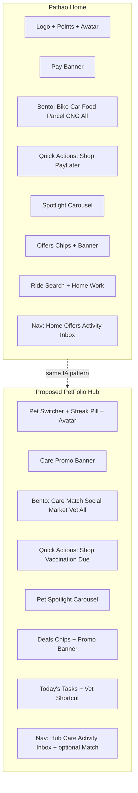

# Pathao App UI/UX Design Analysis & PetFolio Adaptation Guide

This document summarizes a comprehensive review of the Pathao Android application UI/UX (v5.x), based on all **35 screenshots** in `pathao-app-ui/` and the full `pathao-app-ui/review.md` walkthrough documentation. It covers Pathao’s design language, navigation model, and how those patterns can map to PetFolio’s current architecture in `lib/`.

---

## Table of Contents

1. [Pathao’s Core Design System](#1-pathaos-core-design-system)
2. [Home Screen — Pathao’s Central Hub](#2-home-screen--pathaos-central-hub)
3. [Navigation Architecture](#3-navigation-architecture)
4. [Reusable UI Patterns (Across Screens)](#4-reusable-ui-patterns-across-screens)
5. [What Pathao Does Well (and What to Avoid)](#5-what-pathao-does-well-and-what-to-avoid)
6. [PetFolio Today vs Pathao](#6-petfolio-today-vs-pathao)
7. [Recommended PetFolio Mapping](#7-recommended-petfolio-mapping)
8. [Suggested Implementation Phases](#8-suggested-implementation-phases)
9. [Home Screen Side-by-Side Concept](#9-home-screen-side-by-side-concept)
10. [Summary](#10-summary)
11. [Screenshot Reference Index](#11-screenshot-reference-index)

---

## 1. Pathao’s Core Design System

| Element | Pathao Pattern |
|--------|----------------|
| **Primary color** | Crimson red `#E51A24` — CTAs, active nav, badges, brand |
| **Canvas** | White/off-white `#F5F7F9` with light gray section dividers |
| **Typography** | Bold sans-serif titles; medium gray body; uppercase section eyebrows (`QUICK ACTIONS`) |
| **Illustrations** | 3D clay/isometric icons on every service card |
| **Shape language** | ~12–20px rounded corners on cards, pills, search bars |
| **Depth** | Soft drop shadows on cards; no heavy glassmorphism |
| **Accent colors** | Green for discounts/savings; navy for wallet (Pathao Pay); gold for loyalty tiers |

Pathao feels like a **service marketplace hub**: one home screen routes you into many verticals (ride, food, shop, parcel). PetFolio is closer to a **pet-centric lifestyle app** with five pillars — the Pathao patterns still apply, but the *content model* differs.

### Visual Identity (from review.md)

- **Color Palette**: Dominant high-saturation Crimson Red (`#E51A24`) as primary interactive and branding color, balanced against clean white canvas, slate gray text typography, and deep charcoal titles. Secondary colors: soft green (discounts/badges), deep navy (Pathao Pay).
- **Typography**: Clean sans-serif with proportional line heights. Title labels use bold weights; supporting subtitles use medium/regular weights.
- **Iconography & Graphic Style**: Custom 3D clay-style graphics and vibrant isometric illustrations for service categories.

---

## 2. Home Screen — Pathao’s Central Hub

### Top zone (`01_home_screen_top.png`)

```
┌─────────────────────────────────────────┐
│ [pathao logo]     [152 Points Use >] [👤]│
├─────────────────────────────────────────┤
│ ┌─────────────────────────────────────┐ │
│ │  Pathao Pay — Connect Now (navy)    │ │
│ └─────────────────────────────────────┘ │
├─────────────────────────────────────────┤
│ ┌──────────┐ ┌──────────┐               │
│ │  BIKE    │ │   CAR    │  ← large 2×1  │
│ │  (3D)    │ │  (3D)    │               │
│ └──────────┘ └──────────┘               │
│ ┌──────────┐ ┌────┐ ┌────┐ ┌────┐       │
│ │  FOOD    │ │Parc│ │CNG │ │All │       │
│ │ UP TO30% │ │    │ │    │ │ ↓  │       │
│ └──────────┘ └────┘ └────┘ └────┘       │
├─────────────────────────────────────────┤
│ QUICK ACTIONS                           │
│ [Shop NEW!!]  [PayLater Blocked!]       │
└─────────────────────────────────────────┘
```

**Design concepts:**

- **Bento grid** — high-frequency services (Bike/Car) get large tiles; others are smaller.
- **Promo banner** above the grid — wallet/fintech upsell (Pathao Pay).
- **Header utility row** — loyalty points pill + profile avatar (profile is *not* a bottom tab).
- **Quick Actions** — horizontal cards for secondary flows (Shop, PayLater status).
- **“All” tile** opens a bottom sheet catalog (`12_all_services_screen.png`).

**Analysis (review.md):** A clean bento-grid layout prioritizing high-frequency actions (Bike/Car) in larger containers, while lower-frequency elements occupy smaller grid cells.

### Bottom zone (`02_home_screen_bottom.png`)

Scrolling reveals:

- **Pathao Spotlight** — horizontal promo cards with thick red borders
- **Exclusive Offers** — filter chips (`All`, `Notice`, `Bike`) + doodle-pattern banner carousel
- **Take a Ride to** — destination search + saved Home/Work shortcut cards

**UX insight:** Home is both a **launcher** and a **discovery feed**. Search and saved destinations reduce friction for repeat ride users.

---

## 3. Navigation Architecture

### Primary bottom nav (4 tabs)

| Tab | Role |
|-----|------|
| **Home** | Service hub + promos |
| **Offers** | Promo codes, point deals |
| **Activity** | Transaction history by service type |
| **Inbox** | Updates + Promotions (segmented tabs) |

**Active state:** Red filled icon + red label + **red horizontal bar above icon** (not a floating pill).

Profile lives at **Account & Settings** (`06_profile_screen.png`), reached from the header avatar — with a **Gold tier loyalty card**, grouped settings (`ACCOUNT`, `OFFERS`), and list rows with chevrons.

### Secondary navigation (per vertical)

Each service gets its own stack:

| Vertical | Entry | Sub-nav / pattern |
|----------|-------|-------------------|
| **Ride** (Bike/Car/CNG) | Home tile → map + “Where are you going?” | Recent/Saved tabs, Set on Map |
| **Food** | Home tile | Own 5-tab bar: Food, Pick-up, Offers, Favorites, Reorder |
| **Shop** | Quick Action / All Services | Intro onboarding → catalog with categories + “Shops you’ll love” |
| **Parcel/Courier/Rentals** | All Services sheet | Onboarding carousel → primary CTA |

**Flow pattern:** Home tile → optional intro/onboarding → feature-specific shell → task flow (map, catalog, checkout).

### All Services bottom sheet (`12_all_services_screen.png`)

- Drag handle at top, close (X) button
- Two-column vertical grid of service cards
- Each card: title + description left, 3D illustration right
- “NEW” badges, discount tags (e.g. Food “UP TO 30%”)
- “See More” pill at bottom expands to additional services (Pharma, Top-Up)

### Offers screen (`03_offers_screen.png`)

- Segmented toggle: “Available Promos” vs “Point Deals”
- Filter chips by category (All, Food, Bike)
- Promo cards: code, category tag, description, validity, “Add promo” outlined button

### Activity screen (`04_activity_screen.png`)

- Horizontal filter chips by service (Car, Bike, Food, Parcel)
- “Show Cancelled Rides” toggle
- Timeline cards: date, price, route dots (pickup blue → destination red), driver avatar
- Action row: Return, Request Again, RATE NOW

### Inbox screen (`05_inbox_screen.png`)

- Segmented tabs: Updates | Promotions
- Empty state: 3D red mailbox illustration + “No updates yet...”
- Active tab: red underline + red icon

---

## 4. Reusable UI Patterns (Across Screens)

### Filter chips

Pill buttons: active = solid red + white text; inactive = white + gray border. Used on Offers, Activity, Home promos.

### Card lists

White cards on gray background; section headers bold left, “See All >” right.

### Empty states

Centered 3D illustration + bold title + gray subtitle (Inbox, Food out-of-range, ride Recent).

### Bottom sheets

- **All Services** — drag handle, 2-column grid, “See More”
- **Product customization** — variant picker + quantity + Confirm CTA with price inline
- **Address entry** — label toggles (Home/Work), area dropdown, map pin

### E-commerce: Shop (`13_shop_screen.png`)

- Back + logo header, package + cart icons
- Full-width search pill
- Hero promo carousel with pagination dots
- Horizontal category cards (Fashion, Grocery, Electronics) with 3D illustrations
- Secondary promo banner with countdown
- “Shops you’ll love” vendor cards with product thumbnails

### E-commerce: Product details (`16_product_details_screen.png`)

- Seller row (avatar, name, category, chevron)
- Image carousel with red pill pagination
- Title, strikethrough price, discount badge, current price
- Shipping & Returns info card
- Sticky footer: Add to Cart (outlined) + Buy Now (solid red)

### E-commerce: Customization sheet (`17_product_customization_sheet.png`)

- “Customize as per your choice” header
- Radio options with COMPLETE badge
- Quantity stepper + Confirm button showing price

### E-commerce: Checkout (`34_checkout_with_address.png`)

Stacked section cards:

1. Deliver To (+ Manage Address)
2. Your Products (vendor grouping, qty stepper)
3. Apply Promo Code (green accent row)
4. Pay via
5. Sticky footer: savings banner (green) + **Place Order** (red, total on right)

### Map / booking (`07_bike_booking_screen.png`)

Unified search card (pickup + destination), Recent/Saved tabs, empty-state illustration, “Set On Map” fallback.

### Food catalog (`09_food_main_screen_home_address.png`)

- DELIVER TO header with address dropdown
- Search bar + filter button
- Horizontal circular category icons (Biryani, Indian, Fast Food, etc.)
- Promo banner cards with ORDER NOW overlay
- “Picks For You” restaurant cards: image, discount badge, cuisine tags, rating, delivery fee, distance
- Sub-nav: Food, Pick-up, Offers, Favorites, Reorder

### Onboarding screens

- **Parcel** (`10_parcel_screen.png`): illustration, headline, pagination dots, “Let’s explore” CTA
- **Shop intro** (`13_shop_intro_screen.png`): feature list with icon circles, value props, CTA

---

## 5. What Pathao Does Well (and What to Avoid)

### Borrow

- Bento service grid on a single hub screen
- Sectioned scroll feed (Spotlight → Offers → Quick destinations)
- Bottom sheet for “see all services”
- Consistent sub-flow shells (search bar + horizontal categories + vertical list)
- Checkout as stacked cards with disabled CTA until form valid
- Category filter chips everywhere

### Avoid (from review.md friction points)

| Issue | Impact | Heuristic |
|-------|--------|-----------|
| **Pay Later blocking modal** on every Home return | Disrupts exploration; dismiss tap target hard to reach | User control and freedom |
| **Separate identical map screens** for Bike/Car/CNG | Redundant cognitive load; pre-decide vehicle before map | Consistency and standards |
| **Food empty state** without address recovery CTA | Users assume service unavailable vs coordinate mismatch | Help users recover from errors |
| **Address label default mismatch** (Home highlighted but Confirm disabled) | Critical blocker unless user toggles label | Error prevention, visibility of status |
| **Keyboard shifting bottom sheet** during area dropdown | Accidental selections | Flexibility and efficiency of use |

### Actionable recommendations (from review.md)

1. Limit Pay Later popup to booking initiation; add explicit dismiss button
2. Merge ride entry into unified map + vehicle comparison bottom sheet
3. Add “Change Address” CTA inside Food empty state; suggest nearby areas
4. Shorten Shop skeleton loading for perceived performance
5. Fix address label form validator to match visual default
6. Anchor dropdown lists during keyboard display; prevent layout jumps

---

## 6. PetFolio Today vs Pathao

Current shell in `lib/core/widgets/app_shell.dart`:

```dart
const appShellDestinations = [
  AppShellDestination(..., label: 'Pets',   path: '/home'),
  AppShellDestination(..., label: 'Care',   path: '/care'),
  AppShellDestination(..., label: 'Social', path: '/social'),
  AppShellDestination(..., label: 'Match',  path: '/matching'),
  AppShellDestination(..., label: 'Market', path: '/marketplace'),
];
```

| Aspect | Pathao | PetFolio |
|--------|--------|----------|
| **Home role** | Multi-service launcher | Active pet profile + quests (`PetProfileScreen`) |
| **Bottom nav** | 4 tabs, flat bar, single accent | 5 tabs, floating pill, per-tab accent colors |
| **Header** | Logo + points + avatar | Glass pet switcher + contextual actions |
| **Visual tone** | Red/white retail | Warm multi-pillar (tangerine, sunny, poppy, lilac, mint) |
| **Profile** | Settings stack from avatar | Scattered (`/pets/manage`, notifications) |

PetFolio already has the **feature modules** Pathao spreads across tiles; what’s missing is a **Pathao-style hub layer** that surfaces them from one scrollable home.

---

## 7. Recommended PetFolio Mapping

### A. New “Hub Home” (Pathao Home equivalent)

Keep `/home` as hub; move deep pet profile to `/pets/:id` or a section on the same scroll.

**Bento grid → PetFolio services:**

| Pathao tile | PetFolio tile | Route |
|-------------|---------------|-------|
| Bike / Car | **Care** (tasks, streak) | `/care` |
| Food | **Nutrition** | `/care/nutrition` |
| Match (implicit) | **Match** | `/matching` |
| Shop | **Market** | `/marketplace` |
| Parcel | **Appointments / Vet** | `/appointments` |
| Social (implicit) | **PawsFeed** | `/social` |
| All | **All Features** bottom sheet | — |

**Header row (Pathao-style):**

- Left: PetFolio wordmark or active pet chip (keep switcher)
- Right: **Care streak / points pill** + avatar → profile/settings

**Promo banner slot:** Care streak, vaccination due, or marketplace promo (not fintech).

**Quick Actions row:**

- “Shop for {pet}” → `/marketplace`
- “Vaccination due” / “Low food stock” → contextual care deep links

**Scroll sections:**

- **Pet Spotlight** — match candidates, trending posts, shop deals (horizontal cards)
- **Exclusive Offers** — marketplace promos + care badges
- **Quick care** — today’s tasks preview (like Pathao’s Home/Work shortcuts)

### B. Bottom nav realignment (optional hybrid)

Pathao uses 4 utility tabs. PetFolio could use:

| Tab | Pathao analog | PetFolio |
|-----|---------------|----------|
| Home | Home | **Hub** (new bento home) |
| Activity | Activity | **Care log** / appointments history |
| Offers | Offers | **Deals** (marketplace + care rewards) |
| Inbox | Inbox | **Notifications** (`/social/notifications` + FCM) |

Keep **Match** and **Social** as bento tiles or sub-nav inside hub rather than always-on tabs — or retain 5 tabs but adopt Pathao’s **active indicator bar** instead of the floating pill if closer parity is desired.

### C. Per-feature shells (copy Pathao layouts)

**Marketplace** (`13_shop_screen.png`) — close to current implementation:

- Search pill, hero carousel, horizontal categories, “Shops you’ll love”, product rows
- Add shop intro onboarding (`13_shop_intro_screen.png`) for first visit

**Food-style catalog for marketplace browse:**

- `DELIVER TO` → **Shop for {pet name}**
- Category circles (Food, Toys, Health, Grooming)
- Restaurant cards → **Shop cards** (rating, distance, discount tags)

**Matching** — Pathao ride map pattern:

- Unified destination/search first
- Compare “playdate / breeding / walking” in one bottom sheet (avoid separate identical screens)

**Care** — Pathao Activity pattern:

- Filter chips: All, Medical, Nutrition, Grooming
- Timeline cards with status dots + “Repeat task” / “Log again”

**Checkout** — align marketplace checkout with Pathao’s stacked cards + green savings bar + sticky Place Order

### D. Design tokens (adapt, don’t clone red)

Keep PetFolio `AppColors` pillars; apply Pathao **structure** with existing palette:

| Pathao token | PetFolio equivalent |
|--------------|---------------------|
| Primary red CTA | `AppColors.poppy` or `tangerine` (single primary for CTAs) |
| Green discount | `AppColors.mint` / `success` |
| Section gray bg | `surface1` / `cream` |
| 3D service icons | Custom pet 3D assets per pillar |
| Red active nav | Selected tab uses **one** accent + top indicator bar |

---

## 8. Suggested Implementation Phases

### Phase 1 — Hub home screen

- New `HubScreen` at `/home` with bento grid, quick actions, spotlight carousel
- `AllFeaturesSheet` bottom sheet (2-column grid)
- Reuse existing `context.go()` routes from tiles

### Phase 2 — Nav polish

- Pathao-style bottom bar variant (flat + top indicator) as an option or replacement for `_FloatingNav`
- Consolidate profile into `/settings` stack from header avatar

### Phase 3 — Vertical shell templates

- `PathaoStyleCatalogShell` widget: header + search + chip row + sliver list (Food/Shop pattern)
- Apply to Marketplace and Social discovery

### Phase 4 — Checkout & sheets

- Refactor checkout UI to stacked section cards
- Product variant sheet matching Pathao customization pattern

### Phase 5 — Activity & Inbox

- `/activity` unified history (orders, appointments, care logs, matches)
- Inbox tab merging notifications + promos with segmented control

---

## 9. Home Screen Side-by-Side Concept



---

## 10. Summary

Pathao’s strength is **information architecture**: one scannable home, bento prioritization, bottom-sheet overflow for long tail services, and consistent sub-flow templates (search → categories → list → sheet checkout). Visually it is **card-heavy, red-accent, illustration-rich, and sectioned vertically**.

PetFolio should **not** replace its warm multi-pillar identity with Pathao red — but it should adopt the **hub-and-spoke model**, **bento launcher**, **horizontal discovery sections**, **filter chips**, **stacked checkout cards**, and **utility tabs** (Offers / Activity / Inbox) while keeping pet context in the header.

---

## 11. Screenshot Reference Index

All screenshots live in `pathao-app-ui/`. Full walkthrough details are in `pathao-app-ui/review.md`.

| File | Screen |
|------|--------|
| `01_home_screen_top.png` | Home (top): logo, points, Pay banner, bento grid |
| `02_home_screen_bottom.png` | Home (bottom): Spotlight, Offers, ride search |
| `03_offers_screen.png` | Offers (top) |
| `03_offers_screen_bottom.png` | Offers (bottom) |
| `04_activity_screen.png` | Activity (top) |
| `04_activity_screen_bottom.png` | Activity (bottom) |
| `05_inbox_screen.png` | Inbox — Updates (empty) |
| `05_inbox_promotions.png` | Inbox — Promotions |
| `06_profile_screen.png` | Account & Settings (top) |
| `06_profile_screen_bottom.png` | Account & Settings (bottom) |
| `07_bike_booking_screen.png` | Bike booking / destination search |
| `08_car_booking_screen.png` | Car booking |
| `09_food_main_screen.png` | Food — empty state |
| `09_food_main_screen_home_address.png` | Food — populated |
| `09_food_main_screen_home_address_bottom.png` | Food — scrolled |
| `10_parcel_screen.png` | Parcel onboarding |
| `11_cng_booking_screen.png` | CNG booking |
| `12_all_services_screen.png` | All Services sheet |
| `12_all_services_screen_expanded.png` | All Services expanded |
| `13_shop_intro_screen.png` | Shop intro onboarding |
| `13_shop_screen.png` | Shop catalog |
| `13_shop_screen_bottom.png` | Shop catalog scrolled |
| `14_rentals_screen.png` | Rentals |
| `14_rentals_screen_bottom.png` | Rentals scrolled |
| `15_courier_screen.png` | Courier |
| `16_product_details_screen.png` | Product details |
| `17_product_customization_sheet.png` | Variant selector sheet |
| `18_checkout_screen.png` | Checkout initial |
| `18_checkout_screen_bottom.png` | Checkout initial (bottom) |
| `19_address_selection_screen.png` | Address selection |
| `20_address_selection_screen_typed.png` | Address selection typed |
| `21_add_address_sheet.png` | Add address sheet |
| `22_address_sheet_typed.png` | Address sheet typed |
| `23_address_dropdown_clicked.png` | Address dropdown |
| `24_address_sheet_keyboard_hidden.png` | Address form |
| `25_area_selector_open.png` | Area dropdown |
| `26_area_selected.png` | Area selected |
| `27_area_confirmed.png` | Area confirmed |
| `28_area_selected_success.png` | Area success |
| `29_area_selected_success_real.png` | Area success (real) |
| `30_checkout_address_saved.png` | Checkout address saved |
| `31_address_sheet_scrolled.png` | Address sheet scrolled |
| `32_address_sheet_extended.png` | Address sheet extended |
| `33_label_toggled.png` | Label selector validated |
| `34_checkout_with_address.png` | Checkout with address |
| `35_checkout_receipt_details.png` | Receipt breakdown |

---

*Generated from visual review of `pathao-app-ui/` screenshots and `pathao-app-ui/review.md`, cross-referenced with PetFolio `lib/core/widgets/app_shell.dart` and `lib/core/router.dart`.*
