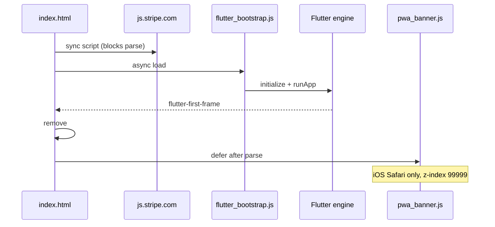

# PetFolio Web / PWA Audit (Android unchanged)

**Scope:** `web/` directory, Vercel deploy, iOS Safari + Add to Home Screen PWA, `lib/` platform gaps.  
**Date:** 2026-06-05 (revised — full `web/` review with `index.html` accessible)  
**Goal:** Parity with Android where feasible; identify freeze / dead-touch causes and platform gaps.

---

## Executive summary

The **`web/` layer is small but intentional** (custom splash, iOS meta, Stripe.js, install banner). It follows modern Flutter bootstrapping (`flutter_bootstrap.js` + `flutter-first-frame`). **`lib/` remains mobile-first** with only **three `kIsWeb` branches** — that gap still drives missing location/notifications and most feature parity issues.

**Highest-probability causes of “frozen screen / buttons not clickable” on iOS PWA:**

| # | Cause | Where |
|---|--------|--------|
| 1 | Flutter iOS PWA engine bugs (ghost keyboard viewport after `TextField`) | Engine — [flutter#111896](https://github.com/flutter/flutter/issues/111896), [flutter#115829](https://github.com/flutter/flutter/issues/115829) |
| 2 | `#pwa-loading` never removed if `flutter-first-frame` never fires | `web/index.html` |
| 3 | **Double safe-area** — CSS `body` padding + Flutter `MediaQuery.padding` | `web/index.html` + `AppShell` floating nav |
| 4 | **`pwa_banner.js`** fixed bottom sheet (`z-index: 99999`) in iOS Safari (pre-install) | Overlaps Flutter bottom nav hit zone |
| 5 | Full-screen Flutter overlays + bottom sheets + keyboard | `lib/` UI |
| 6 | Heavy `CachedNetworkImage` → Safari reload on real devices | Social / matching |

---

## `web/` directory — full review

### Inventory

| File | Lines | Purpose |
|------|-------|---------|
| `web/index.html` | 123 | App shell, PWA meta, splash, Stripe, bootstrap |
| `web/manifest.json` | 39 | Web app manifest |
| `web/pwa_banner.js` | 69 | iOS Safari “Add to Home Screen” promo |
| `web/icons/*`, `web/favicon.png` | (Flutter defaults) | Referenced by HTML/manifest; standard `flutter create` assets |

There is **no** custom `web/flutter_bootstrap.js` — the project uses the **build-generated** bootstrap (correct for Flutter 3.22+).

---

### `web/index.html` — line-by-line assessment

#### Document head — good

| Lines | Content | Verdict |
|-------|---------|---------|
| 4 | `<base href="$FLUTTER_BASE_HREF">` | Correct; substituted at `flutter build web` |
| 10–11 | `viewport-fit=cover` | Required for notched iOS PWA |
| 13–14 | Meta description (UTF-8 em dash) | OK |
| 17–20 | `theme-color` light/dark | Matches brand |
| 23–26 | `mobile-web-app-capable` + `apple-mobile-web-app-capable` | Redundant but harmless |
| 25 | `black-translucent` status bar | Good for edge-to-edge; pairs with safe-area handling |
| 29–30 | `apple-touch-icon` 192 + 512 | OK; Apple often prefers 180×180 — consider adding |
| 33 | `favicon.png` | OK if present in `web/` after `flutter create` |
| 36 | `manifest.json` link | OK |

#### Stripe.js — risk

```38:39:web/index.html
  <!-- Stripe JS must load before Flutter -->
  <script src="https://js.stripe.com/v3/"></script>
```

| Issue | Severity | Detail |
|--------|----------|--------|
| **Synchronous third-party script in `<head>`** | **High** | Blocks HTML parsing until `js.stripe.com` responds. Slow networks delay first paint and can delay `flutter-first-frame` → splash feels “stuck”. |
| **No `async` / `defer`** | Medium | Flutter Stripe may need Stripe global before payment; for **startup**, defer until first checkout or load with `defer` + readiness check in Dart. |
| **No SRI / fallback** | Low | Stripe CDN outage = blank or hung boot if combined with other failures |

**Recommendation:** Load Stripe only when entering checkout (dynamic `<script>` injection) or use `defer` and guard `Stripe` in `checkout_controller` until `window.Stripe` exists.

#### CSS — mixed

| Lines | Rule | Verdict |
|-------|------|---------|
| 43–49 | `html, body` full size, `overscroll-behavior: none` | Good — reduces iOS rubber-banding |
| 55–61 | **`body` safe-area `env()` padding** | **P0 bug** — Flutter also applies `MediaQuery.padding` / `SafeArea`. **Double inset** shrinks canvas and **offsets pointer coordinates** vs visual layout, especially with `AppShell` `bottom: 12 + padding.bottom` nav. **Remove this block**; handle insets only in Dart. |
| 64–71 | `#pwa-loading` full-screen `z-index: 9998` | OK |
| 71 | `.hidden { pointer-events: none }` | Good |
| 93–96 | Pulse animation on logo | OK; respect `prefers-reduced-motion` optionally |

**Missing CSS (recommended):**

```css
body { touch-action: manipulation; } /* reduces 300ms tap delay legacy */
```

Optional: `-webkit-tap-highlight-color: transparent` for app-like feel.

#### Body — bootstrap & splash

| Lines | Content | Verdict |
|-------|---------|---------|
| 101–105 | `#pwa-loading` splash | Good UX |
| 101 | `aria-hidden="true"` | Hides from a11y tree while visible — OK for decorative splash |
| 107 | `<script src="flutter_bootstrap.js" async>` | **Correct** modern Flutter pattern ([docs](https://docs.flutter.dev/platform-integration/web/initialization)) |
| 109–117 | `flutter-first-frame` → hide splash | **Required path** — if event never fires, app stays blocked |
| 120–121 | `pwa_banner.js` `defer` | Runs after document parse; see stacking below |

**Missing in `index.html` (P0/P1):**

1. **Splash timeout** (e.g. 25s) — remove splash, show “Failed to load — Refresh” + `console.error`.
2. **`window.addEventListener('error')` / bootstrap catch** — surface WASM/JS load failures.
3. **iOS startup images** — `apple-touch-startup-image` for A2HS launch (optional P2).
4. **No `touch-action` on `body`** — minor tap responsiveness on older WebKit.

**Suggested splash fallback (concept):**

```html
<script>
  var splashTimeout = setTimeout(function () {
    var el = document.getElementById('pwa-loading');
    if (el && !el.classList.contains('hidden')) {
      document.getElementById('pwa-loading-sub').textContent =
        'Taking longer than usual. Check connection and refresh.';
    }
  }, 25000);
  window.addEventListener('flutter-first-frame', function () {
    clearTimeout(splashTimeout);
    /* existing hide logic */
  });
</script>
```

#### Script load order (actual)



---

### `web/pwa_banner.js` — full review

| Behavior | Detail |
|----------|--------|
| **Target** | iPhone/iPad/iPod, **not** `navigator.standalone`, not dismissed |
| **UI** | Fixed bottom sheet, `z-index: 99999`, ~120px+ tall |
| **Copy** | “works offline too” — **misleading** (no custom offline cache strategy) |
| **Dismiss** | `localStorage.pwa_banner_dismissed` |

| Issue | Severity | Detail |
|--------|----------|--------|
| **Covers Flutter bottom nav** | **High** (Safari pre-install) | Before A2HS, users browse in Safari with banner + Flutter `AppShell` floating nav — **same bottom band**. Taps may hit DOM banner instead of Flutter canvas. |
| **`z-index: 99999` above everything** | High | Intentional for promo, but blocks app chrome until dismissed |
| **“Offline” claim** | Medium | Legal/UX trust issue unless you implement offline |
| **No `safe-area-inset-bottom` on banner** | Medium | On notched phones, banner padding may clash with home indicator |
| **`role="banner"`** | Low | Competes semantically with app header |

**Recommendations:**

1. After `flutter-first-frame`, inject banner **inside** a known layout OR show install CTA **inside Flutter** on `kIsWeb` + iOS user-agent.
2. Add `padding-bottom: calc(32px + env(safe-area-inset-bottom))` to `#pwa-banner`.
3. Change copy to: “Add to Home Screen for app-like experience” (drop offline unless implemented).
4. In standalone mode you already skip banner — good.

---

### `web/manifest.json` — full review

| Field | Value | Verdict |
|-------|-------|---------|
| `display` | `standalone` | Correct for PWA |
| `orientation` | `portrait-primary` | Matches mobile app; web desktop gets letterboxing |
| `start_url` / `scope` | `/` | OK with Vercel SPA rewrite |
| `theme_color` / `background_color` | Brand cream / orange | Matches splash |
| `icons` | 192, 512, maskable | OK |
| `screenshots` | `[]` | Empty — weak install UI on Chromium |
| `id` | absent | Consider `"id": "/"` per spec for update stability |
| `display_override` | absent | Optional: `["standalone", "browser"]` |

**Missing for iOS (not in manifest — use HTML):**

- Apple does not use `manifest.json` for A2HS; relies on `apple-mobile-web-app-*` in `index.html` — **you have those**.

**Recommendations (P2):**

- Add `screenshots` for Play-style install on Android/desktop Chrome.
- Add `shortcuts` for `/care`, `/matching`, `/marketplace`.

---

### `web/` vs Vercel / CI

| Config | Finding |
|--------|---------|
| `vercel.json` | Rewrites all non-file routes → `index.html` — **GoRouter deep links work on refresh** |
| `vercel.json` headers | COEP/COOP **only on `*.wasm`** — document root not cross-origin isolated unless you build with `--wasm` and add page-level headers |
| `deploy-web.yml` | `flutter build web --release` — **no** `--wasm`, **no** `--web-renderer` pin, `flutter-version: 3.x` loose |
| Custom `web/` files | Copied into `build/web` on build — **index.html / manifest / pwa_banner.js ship as edited** |

---

## PWA infrastructure (summary)

| Asset | Role |
|--------|------|
| `web/index.html` | Meta, splash, Stripe, bootstrap |
| `web/manifest.json` | Installability (Android/desktop) |
| `web/pwa_banner.js` | iOS Safari install funnel |
| `vercel.json` | SPA + SW cache + WASM headers |
| `.github/workflows/deploy-web.yml` | Build + Vercel deploy |

| Gap | Severity |
|-----|----------|
| No `lib/core/platform/web/` | High |
| Stripe sync in `<head>` | High |
| Body safe-area double-count | **P0** |
| No splash error path | **P0** |
| COEP partial / no `--wasm` in CI | Medium |
| Offline claim in banner | Medium |

---

## Startup & `lib/main.dart`

```dart
if (!kIsWeb) await NotificationService.instance.initialize();
Stripe.publishableKey = ...
await Stripe.instance.applySettings();
await Supabase.initialize(...);
```

| Behavior | Web impact |
|----------|------------|
| Notifications init skipped | OK, but care still schedules reminders (below) |
| Stripe + Supabase before `runApp` | Any await failure → **no `flutter-first-frame`** → splash stuck |
| `GoogleFonts.config.allowRuntimeFetching = false` | Good for web |

---

## Platform capability matrix (Android vs Web PWA)

| Capability | Android | Web / iOS PWA | Recommendation |
|------------|---------|---------------|----------------|
| Care reminders | Local notifications | Init skipped; **still scheduled** in `pet_care_repository.dart` | `kIsWeb` guard + Web Push |
| GPS | `geolocator` | Always `unavailable` | `navigator.geolocation` bridge |
| Matching | GPS + profile | **Always location-blocked UI** | Web geo + allow profile `location` |
| Checkout | Payment Sheet | `flutter_stripe_web` | Checkout redirect on web/iOS |
| Photos | `image_picker` | Weak on web | `file_picker` / file input bridge |
| AI care | NVIDIA direct | Edge Function on web | Keep |

---

## `lib/` UI issues (amplified on iOS PWA)

### `AppShell` — stacked chrome

```93:111:lib/core/widgets/app_shell.dart
      body: Stack(
        children: [
          Positioned.fill(child: child),
          Positioned(top: 0, child: AppShellHeader(...)),
          Positioned(bottom: ..., child: _FloatingNav(...)),
        ],
      ),
```

- Bottom nav sits in the **iOS PWA dead-zone** after keyboard use.
- Combined with **`body` CSS safe-area** → systematic hit-test skew.

### Other hotspots

- `PrimaryPillButton` — `Listener` only (no `Material` ink).
- `MatchingScreen` — `unavailable` ⇒ blocked; `IgnorePointer` when celebration overlay active.
- Many `TextField`s, bottom sheets, large images.

---

## `kIsWeb` inventory (entire `lib/`)

| File | Usage |
|------|--------|
| `main.dart` | Skip notification init |
| `location_service.dart` | Disable geolocation |
| `care_recommendation_service.dart` | Edge Function on web |

---

## Care notifications bug (web)

`pet_care_repository.dart` → `_scheduleNotificationIfNeeded` calls `NotificationService` without `kIsWeb` guard.

---

## Recommended roadmap (web/PWA only)

### Phase 0 — Diagnose

1. iPhone: Safari (with banner) vs standalone PWA.
2. Web Inspector: Stripe load time, `flutter-first-frame`, errors.
3. Confirm splash clears; test after login TextField + keyboard dismiss.

### Phase 1 — `web/` + P0 (highest ROI) — **DONE (2026-06-05)**

1. ~~**Remove `body` safe-area CSS**~~ — done in `web/index.html`.
2. ~~**Splash timeout + error message**~~ — done in `web/index.html`.
3. ~~**Defer Stripe.js**~~ — `defer` in HTML; `ensureStripeReady()` at checkout on web.
4. ~~**Fix `pwa_banner`**~~ — safe-area padding + copy fix.
5. ~~**`kIsWeb` guards**~~ — notifications, geolocator web, matching profile-location fallback.
6. ~~**AppShell web layout**~~ — `bottomNavigationBar` on web.

### Phase 2 — Parity — **DONE (2026-06-05)**

1. **`lib/core/platform/`** — `PlatformNotifications` (io local / web `care_web_reminders`), `media_picker` (gallery via `image_picker` on web), `platform_payments`, `web_push_registration`, `platform_services.dart` barrel.
2. **Stripe Checkout redirect on web** — `create-payment-intent` `checkout_mode`; `OrderRepository.createCheckoutSession`; `CheckoutNotifier` opens hosted URL; resume polling via `WebCheckoutResumeListener`; webhook `checkout.session.expired`.
3. **Web care reminders** — `care_web_reminders` table + web notification scheduling (server dispatch still requires VAPID/cron — see deploy notes).
4. **Web Push registration** — `user_web_push_subscriptions`, edge function `register-web-push-subscription`, `web/push_register.js`, Care `WebPushEnableBanner` (needs `WEB_PUSH_VAPID_PUBLIC_KEY` dart-define).
5. **Media uploads** — `pickGalleryImage()` wired in profile, social, shop, KYC, medical vault.

### Phase 3 — Polish — **DONE (2026-06-05)**

1. **`web/manifest.json`** — `id`, `screenshots` (narrow/wide), `shortcuts` for `/care`, `/matching`, `/marketplace`.
2. **`web/screenshots/` + `web/splash/`** — branded PNGs; `index.html` `apple-touch-startup-image` for common iPhone sizes + fallback.
3. **`lib/core/platform/web_image_cache.dart`** — `networkImageMemCacheWidth` / `networkImageMaxDiskCacheWidth` with web Safari caps; wired on feed, stories, matching, marketplace, `PetAvatar`.

---

## Testing checklist (iOS PWA)

- [ ] Splash dismisses &lt; 30s on 4G; timeout message if not
- [ ] iOS Safari **with** install banner — bottom nav tappable after dismiss
- [ ] Standalone PWA — all 5 tabs
- [ ] TextField → keyboard dismiss → bottom controls work
- [ ] Matching deck (after geo fix)
- [ ] Marketplace checkout (web Stripe path)
- [ ] Hard refresh / SW update after deploy

---

## References

- [Flutter web initialization](https://docs.flutter.dev/platform-integration/web/initialization)
- [Flutter WASM / COEP](https://docs.flutter.dev/platform-integration/web/wasm)
- [flutter#111896](https://github.com/flutter/flutter/issues/111896) · [flutter#115829](https://github.com/flutter/flutter/issues/115829)
- [flutter_stripe_web](https://pub.dev/packages/flutter_stripe)

---

*Android APK paths excluded. `web/` reviewed in full including `index.html`.*
