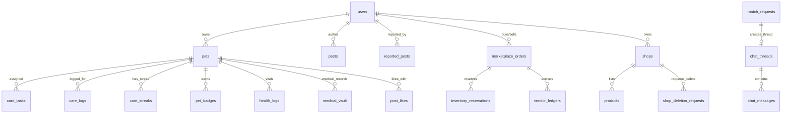
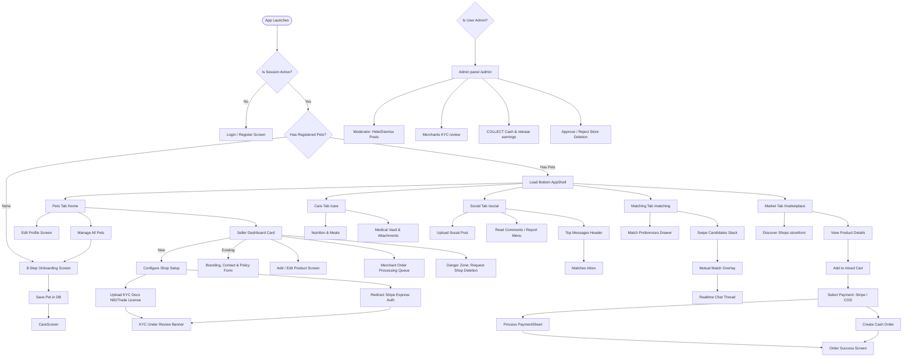

# PetFolio — Comprehensive Platform Review & Analysis

**Date:** 2026-05-21  
**Review Scope:** Full-stack Flutter Codebase + Supabase Database (Tables, RLS Policies, Indexes, Triggers, RPCs) + Edge Functions + Platform User Stories & Navigation Flows

---

## Table of Contents

1. [Executive Summary & Platform Overview](#1-executive-summary--platform-overview)
2. [Codebase Architecture & Core Design System](#2-codebase-architecture--core-design-system)
3. [Exhaustive Module Breakdown](#3-exhaustive-module-breakdown)
4. [Database Schema & ERD Map](#4-database-schema--erd-map)
5. [User Navigation Flows & Life-cycle States](#5-user-navigation-flows--life-cycle-states)
6. [Complete User Stories Mapping](#6-complete-user-stories-mapping)
7. [Security, Performance & Codebase Audit Findings](#7-security-performance--codebase-audit-findings)

---

## 1. Executive Summary & Platform Overview

**PetFolio** is a cutting-edge, premium full-stack mobile application that integrates social networking, dating/playdate matching, digital health vault tracking, and a multi-vendor marketplace with automated e-commerce and onboarding flows. 

It is designed for modern pet owners (pets as family members) and small business owners/sellers, built on a robust architecture that leverages **Flutter** for cross-platform visual excellence and **Supabase (PostgreSQL 17)** for performant, secure, real-time backend functionality.

### Core High-Level Goals
- **Foster Community:** A beautiful social network tailored to sharing pets' lives.
- **Connect Pets:** Geo-location-based playdate, breeding, and adoption discovery.
- **Promote Longevity & Care:** Personalised checklists, streaks, and a digital medical document vault.
- **Power a Pet Economy:** An e-commerce platform where vendors can easily list products, handle Stripe Connect or Cash on Delivery (COD) checkouts, and process automated vendor earnings payouts.
- **Administrative Moderation:** Robust, secure administration panel for moderating content, reviewing manual vendor KYC, resolving Cash on Delivery payouts, and resolving shop deletion requests.

---

## 2. Codebase Architecture & Core Design System

### 2.1 Feature-First Architecture
The codebase strictly adheres to a **Feature-First Architecture** inside the `lib/features/` directory. Each feature folder is modular and separated cleanly into three distinct structural layers:

```
lib/features/{feature_name}/
├── data/
│   ├── models/             # Freezed immutable data classes with JSON serializers
│   └── repositories/       # Supabase-specific DB access classes (handling errors & queries)
└── presentation/
    ├── controllers/        # Riverpod providers, generated notifier state, and UI binding
    ├── screens/            # Full-page high-fidelity UI views
    └── widgets/            # Reusable micro-components specific to the feature
```

### 2.2 Global State Management
- Managed exclusively via **Riverpod** (`flutter_riverpod` and `riverpod_annotation`).
- All state changes, optimistic UI updates (e.g., swiping, care checklist toggles, post liking), and dependency injection are driven by generated Riverpod notifiers.
- Core providers like `activePetIdProvider` globally synchronize the pet currently in focus, automatically updates care checklists, streaks, and medical record histories.

### 2.3 Premium Aesthetics & Core Design System
Designed to wow the user immediately, the frontend respects the design tokens in `PetFolio Design System.md`:
- **Typography:** Features Google Fonts (`Inter` for high-density readable text and `Sora` for brand statements).
- **Harmony & Dark Mode:** Uses curated color palettes structured in dynamic Light and Dark theme configurations with custom extensions (`PetfolioThemeExtension`) for 50+ HSL tailored styling tokens.
- **Adaptive Routing:** Employs `GoRouter` mapping adaptive screens. For screens under 600dp (mobiles), the layout draws a bottom `NavigationBar`. For wider displays (tablets/desktops), it automatically renders a side `NavigationRail` without breaking layouts.
- **Micro-Animations & Visuals:** Packed with dynamic layouts, shimmer skeleton states, custom Glassmorphism components (`GlassCard`), and interactive overlay celebration backdrops.
- **Offline Font Safety:** Initialized with `GoogleFonts.config.allowRuntimeFetching = false` to guarantee complete crash-free offline rendering, supported by verified local copies of both `Inter-Regular.ttf` and `Inter-Bold.ttf`.

---

## 3. Exhaustive Module Breakdown

### 3.1 Authentication (Auth)
- **Files Location:** `lib/features/auth/`
- **Functional Description:** Multi-step authentication flow with clean client-side input validation. Provisioned with secure email/password register and login states.
- **Triggers:** A secure trigger on the database level (`private.handle_new_user()`) intercepts new entries in `auth.users` and automatically provisions their corresponding profile row inside the `public.users` table.
- **State Integration:** The global `isLoggedInProvider` is listened to by GoRouter's `_RouterNotifier` to redirect unauthorized users straight to `/login` or `/register`.

### 3.2 Onboarding & Pet Profile
- **Files Location:** `lib/features/pet_profile/`
- **Functional Description:** 
  - **Onboarding Wizard:** An 8-step highly interactive questionnaire (Welcome, Species & Breed Selection, Name, DOB Picker with calculated age, Weight Input with kg/lbs dynamic converter, Activity Level Grid, Avatar Photo Upload, and Summary).
  - **Active Pet Switcher:** Supports owning multiple pets; handles switching the active pet context via a custom bottom sheet switcher.
  - **Profile Management:** An elegant sectioned form (`EditProfileScreen`) that permits saving custom details, toggling public/discoverable attributes, and updating location markers.
- **Dynamic Accent Colors:** Accent borders and headers automatically shift shade colors matching the species type (e.g. Dog, Cat, Bird, Reptile).

### 3.3 Care, Streaks, & Badges (Health & Gamification)
- **Files Location:** `lib/features/care/`
- **Functional Description:**
  - **Checklist Engine:** Personalised daily tasks based on the pet's activity level and age. Once-off tasks and recurring task profiles are merged and managed under `careDashboardProvider`.
  - **Gamification Streaks:** Completing daily tasks awards points and updates daily care streaks. The dashboard listens to the `care_streaks` table via real-time stream subscriptions (`careStreakRealtimeProvider`) to synchronize user milestone accomplishments immediately.
  - **Milestone Badges:** Unlocking streaks triggers the `check_daily_completion` RPC, which validates task completion states against daily checklist history and automatically adds badges to the pet's reward vault.

### 3.4 Medical Vault & Health Logs
- **Files Location:** `lib/features/care/`
- **Functional Description:**
  - **Medical Tracking:** Logs vaccines, medications, surgeries, and allergies. Sorts records chronologically using cohesive comparisons (`nextDueAt ?? expiresAt ?? administeredAt`), pinning records with no dates to the very end.
  - **Private Medical Attachments:** Direct integration with a private `medical-documents` storage bucket. Owners pick documents, crop/adjust, upload files safely under their owner-scoped folders, and view attached files through 1-hour signed URLs using `url_launcher`.
  - **Vitals & Health Logs:** Dynamic weight logs (providing a clean progression chart) and symptom tracking.

### 3.5 Pet Discovery & Swipe Matching (Pet Dating)
- **Files Location:** `lib/features/matching/`
- **Functional Description:**
  - **PostGIS Spatial Feeds:** Leverages the Postgres `postgis` spatial extension. The database RPC `matching_discovery_candidates` performs lightning-fast proximity computations based on geographical coordinate points.
  - **Tinder-Style Swipes:** Users swipe right (LIKE), left (PASS), up (SUPER_PAW), or double tap (GREET). Swipes are recorded immediately using optimistic UI.
  - **Discovery Preferences:** Bottom sheet filter allowing users to select species, maximum search radius slider, and age ranges. Changes are debounced 450ms to prevent flooding API endpoints.
  - **Mutual Match Overlay:** When both owners mutually express positive interest, the server inserts a record inside the `matches` table. Supabase Realtime detects the mutual match, automatically triggers a full-screen blurred celebratory backdrop overlay, and provisions a secure `chat_thread`.
  - **Inbox & Real-time Chat:** An N+1 query-free inbox loads matching threads. Chat threads connect users via a real-time messaging pipeline.

### 3.6 Multi-Vendor Marketplace (E-Commerce)
- **Files Location:** `lib/features/marketplace/`
- **Functional Description:**
  - **Mixed Cart Checkout:** Buyers can add products from multiple separate shops to a single cart. The checkout screen dynamically clusters items by vendor and initiates payment routing per shop.
  - **Double Payment Paths:** Integration of Stripe Connect (express vendor onboarding with platform fees) and localized Cash on Delivery (COD) checkouts. COD checkouts bypass Stripe entirely, performing active-seller checks and inventory adjustments on the server.
  - **Secure Inventory Reservations:** To eliminate checkout price manipulation and double-allocation race conditions, all prices are server-calculated. Active orders create a 15-minute row reservation inside the `inventory_reservations` table. Successful payment webhook completes the reservation, decrementing inventory; cancellations release the items instantly.
  - **Symmetric KYC Onboarding:** Sellers onboard via Stripe Express redirects or through a localized Bangladesh manual portal (uploading NID/Trade Licenses directly to a private `kyc-documents` bucket).

### 3.7 Secured Admin Moderation Dashboard
- **Files Location:** `lib/features/admin/`
- **Functional Description:** A locked navigation-rail dashboard accessible only if the user's authenticated token carries the `'admin'` metadata claim.
  - **Report Moderation:** Lists reported posts. Admins resolve reports by either dismissing them or calling `resolve_reported_post` to hide the post globally.
  - **KYC Approval Queue:** Inspects submitted merchant documents (NID/Trade licenses) using secure storage viewing, approving the seller's storefront or rejecting with a required explanation note.
  - **COD Earnings Ledger:** Resolves completed COD orders, marking ledger states to "available" to trigger payouts to vendor accounts.
  - **Shop Deletion Panel:** Resolves danger-zone vendor deletion requests. Approving a deletion deactivates the shop and flags all its products inactive in one secure transaction.

---

## 4. Database Schema & ERD Map

The PetFolio platform uses an robust, index-optimized Postgres 17 schema under the `public` schema, with administrative helper operations isolated in a `private` schema.



### 4.1 Exhaustive Table Specifications

#### 1. `public.users`
Stores user profile information mirroring `auth.users`.
- `id` (uuid, PK, References `auth.users(id) ON DELETE CASCADE`)
- `username` (text, UNIQUE, NOT NULL)
- `display_name` (text, DEFAULT '')
- `avatar_url` (text, nullable)
- `bio` (text, nullable)
- `location` (text, nullable)
- `created_at` / `updated_at` (timestamptz)

#### 2. `public.pets`
Stores core pet attributes.
- `id` (uuid, PK, DEFAULT `gen_random_uuid()`)
- `owner_id` (uuid, References `public.users(id) ON DELETE CASCADE`)
- `name` (text, NOT NULL)
- `species` (text, NOT NULL)
- `breed` (text, nullable)
- `date_of_birth` (date, nullable)
- `gender` (text, CHECK `gender IN ('male', 'female', 'unknown')`)
- `weight_kg` (numeric(5,2), nullable)
- `avatar_url` / `bio` (text, nullable)
- `is_public` (boolean, DEFAULT true)
- `is_discoverable` (boolean, DEFAULT false)
- `location` (geography(Point, 4326), nullable) — Geospatial coordinate
- `activity_level` (text, CHECK `activity_level IN ('couch_potato', 'low', 'moderate', 'athlete', 'hyperactive')`)
- `created_at` / `updated_at` (timestamptz)

#### 3. `public.care_tasks`
Checklist definitions and tracking.
- `id` (uuid, PK)
- `pet_id` (uuid, References `public.pets(id) ON DELETE CASCADE`)
- `task_type` (text, CHECK: feeding, walk, grooming, medication, etc.)
- `title` (text, NOT NULL)
- `frequency` (text, CHECK: once, daily, twice_daily, weekly, etc.)
- `scheduled_time` (time, nullable)
- `is_completed` (boolean, DEFAULT false)
- `completed_at` (timestamptz, nullable)
- `gamification_points` (integer, DEFAULT 10)
- `notes` (text, nullable)

#### 4. `public.care_logs`
Historical logs of completed tasks.
- `id` (uuid, PK)
- `pet_id` (uuid, References `public.pets(id) ON DELETE CASCADE`)
- `logged_by` (uuid, References `public.users(id)`)
- `care_type` (text, NOT NULL)
- `notes` / `duration_minutes` (nullable)
- `logged_date` (date, DEFAULT CURRENT_DATE)
- Unique constraint: `(pet_id, care_type, logged_date)`

#### 5. `public.care_streaks`
Active gamification streaks per pet.
- `pet_id` (uuid, PK, References `public.pets(id) ON DELETE CASCADE`)
- `current_streak` (integer, DEFAULT 0)
- `last_completion_date` (date)
- `best_streak` (integer, DEFAULT 0)

#### 6. `public.pet_badges`
Badges earned by pets.
- `pet_id` (uuid, References `public.pets(id) ON DELETE CASCADE`)
- `badge_type` (text, NOT NULL)
- Composite PK: `(pet_id, badge_type)`

#### 7. `public.health_logs`
Health vitals logs.
- `id` (uuid, PK)
- `pet_id` (uuid, References `public.pets(id) ON DELETE CASCADE`)
- `recorded_by` (uuid, References `public.users(id)`)
- `log_type` (text, CHECK: symptom, weight, vet_visit, etc.)
- `title` (text, NOT NULL)
- `description` (text, nullable)
- `weight_kg` (numeric, nullable)
- `severity` (text, CHECK: mild, moderate, severe, critical)
- `vet_name` / `vet_clinic` / `diagnosis` / `treatment` (text, nullable)
- `follow_up_date` (date, nullable)

#### 8. `public.medical_vault`
Stores clinical medical records and certificates.
- `id` (uuid, PK)
- `pet_id` (uuid, References `public.pets(id) ON DELETE CASCADE`)
- `record_type` (text, CHECK: vaccine, medication, surgery, etc.)
- `name` (text, NOT NULL)
- `administered_by` / `batch_number` / `dosage` / `frequency` (text, nullable)
- `administered_at` / `expires_at` / `next_due_at` (date, nullable)
- `is_active` (boolean, DEFAULT true)
- `reminder_enabled` (boolean, DEFAULT true)
- `document_url` (text, nullable) — Link to files in `medical-documents` bucket.

#### 9. `public.posts`
Social timeline content.
- `id` (uuid, PK)
- `author_id` (uuid, References `public.users(id) ON DELETE CASCADE`)
- `pet_id` (uuid, References `public.pets(id) ON DELETE SET NULL`)
- `content` (text, NOT NULL)
- `image_urls` (text[], DEFAULT '{}')
- `visibility` (text, CHECK: public, followers, private)
- `like_count` / `comment_count` (integer, DEFAULT 0)
- `is_hidden` (boolean, DEFAULT false) — Moderation field.

#### 10. `public.reported_posts`
Reports submitted for social posts.
- `id` (uuid, PK)
- `post_id` (uuid, References `public.posts(id) ON DELETE CASCADE`)
- `reporter_id` (uuid, References `public.users(id) ON DELETE CASCADE`)
- `reason` (text, CHECK 1-500 chars)
- `status` (text, CHECK: pending, reviewed, dismissed)
- `reviewed_by` / `reviewed_at` (nullable)

#### 11. `public.swipes`
Matches swipe actions.
- `id` (uuid, PK)
- `actor_pet_id` (uuid, References `public.pets(id) ON DELETE CASCADE`)
- `target_pet_id` (uuid, References `public.pets(id) ON DELETE CASCADE`)
- `action` (text, CHECK: PASS, LIKE, GREET, SUPER_PAW)
- `created_at` (timestamptz)
- Unique constraint: `(actor_pet_id, target_pet_id)`

#### 12. `public.matches`
Reciprocal matches spawned by swiping.
- `id` (uuid, PK)
- `pet_a_id` (uuid, References `public.pets(id) ON DELETE CASCADE`)
- `pet_b_id` (uuid, References `public.pets(id) ON DELETE CASCADE`)
- `created_at` (timestamptz)

#### 13. `public.chat_threads`
Chat channels, auto-provisioned upon match acceptance.
- `id` (uuid, PK)
- `mutual_match_id` (uuid, UNIQUE, References `public.matches(id) ON DELETE SET NULL`)
- `participant_1_id` / `participant_2_id` (uuid, References `public.users(id) ON DELETE CASCADE`)
- `last_message_at` (timestamptz)

#### 14. `public.chat_messages`
Realtime conversation messages.
- `id` (uuid, PK)
- `thread_id` (uuid, References `public.chat_threads(id) ON DELETE CASCADE`)
- `sender_id` (uuid, References `public.users(id)`)
- `content` (text, NOT NULL)
- `is_read` (boolean, DEFAULT false)

#### 15. `public.shops`
Vendor profiles for the marketplace.
- `id` (uuid, PK)
- `owner_id` (uuid, UNIQUE, References `public.users(id) ON DELETE CASCADE`)
- `name` (text, NOT NULL)
- `description` / `logo_url` / `banner_url` (text, nullable)
- `payout_method` (text, CHECK: stripe, manual)
- `kyc_status` (text, CHECK: pending, submitted, approved, rejected)
- `bank_account_details` (jsonb, default '{}')
- `trade_license_url` / `national_id_url` / `rejection_reason` (text, nullable)
- `business_email` / `business_phone` / `return_policy` / `shipping_policy` (text, nullable)
- `address_street` / `address_city` / `address_state` / `address_zip` (text, nullable)
- `social_links` (jsonb, default '{}')
- `is_verified` (boolean, DEFAULT false)
- `is_active` (boolean, DEFAULT true)

#### 16. `public.products`
Store products for the marketplace.
- `id` (uuid, PK)
- `shop_id` (uuid, References `public.shops(id) ON DELETE CASCADE`)
- `name` / `brand` / `variant` (text, NOT NULL)
- `category` (text, CHECK: food, gear, toys, treats, health, grooming)
- `price_cents` (integer, NOT NULL)
- `subscribable` (boolean, DEFAULT false)
- `image_urls` (text[], DEFAULT '{}')
- `inventory_count` (integer, DEFAULT 0, CHECK >= 0)
- `active` (boolean, DEFAULT true)

#### 17. `public.inventory_reservations`
Short-term reservation of product inventory.
- `id` (uuid, PK)
- `order_id` (uuid, References `public.marketplace_orders(id) ON DELETE CASCADE`)
- `product_id` (uuid, References `public.products(id) ON DELETE CASCADE`)
- `quantity` (integer, CHECK > 0)
- `status` (text, CHECK: active, confirmed, released)
- `expires_at` (timestamptz, DEFAULT `now() + 15 mins`)
- Unique partial index: `(order_id, product_id) WHERE status = 'active'`

#### 18. `public.marketplace_orders`
Orders placed by buyers.
- `id` (uuid, PK)
- `buyer_id` (uuid, References `public.users(id) ON DELETE RESTRICT`)
- `shop_id` (uuid, References `public.shops(id) ON DELETE RESTRICT`)
- `amount_cents` (bigint, NOT NULL)
- `payment_method` (text, CHECK: stripe, cod)
- `payment_status` (text, CHECK: pending, paid, collected)
- `status` (text, CHECK: pending, confirmed, shipped, delivered, cancelled, refunded)
- `shipping_address` / `line_items` (jsonb, default '[]')
- `stripe_payment_intent_id` (text, UNIQUE)

#### 19. `public.vendor_ledgers`
Financial ledgers for manual seller payouts.
- `id` (uuid, PK)
- `shop_id` (uuid, References `public.shops(id) ON DELETE CASCADE`)
- `order_id` (uuid, References `public.marketplace_orders(id)`)
- `order_total_cents` / `platform_fee_cents` / `vendor_earnings_cents` (bigint)
- `status` (text, CHECK: pending_clearance, available, paid)

#### 20. `public.shop_deletion_requests`
Vendor deactivation/deletion requests.
- `id` (uuid, PK)
- `shop_id` (uuid, References `public.shops(id) ON DELETE CASCADE`)
- `owner_id` (uuid, References `public.users(id)`)
- `reason` (text, nullable)
- `status` (text, CHECK: pending, approved, rejected)
- `rejection_note` (text, nullable)

---

## 5. User Navigation Flows & Life-cycle States

PetFolio's routes are configured with an authentication and pet ownership lifecycle loop to keep user flows intuitive.



---

## 6. Complete User Stories Mapping

### 6.1 Pet Parent (Standard User)
- **Story: The Onboarding Setup**  
  *As a new user, I want a frictionless onboarding experience where I can set up my dog's profile, including their activity parameters, weight, and breed, so that they have personalized daily task checklist defaults prepared instantly.*
- **Story: Daily Streak Habit**  
  *As an active pet parent, I want to record completion of my pet's tasks (grooming, walks, training) and watch our daily streak increase on the dashboard in real-time, motivating me to care for my pet consistently.*
- **Story: Medical Vault Document Pick**  
  *As a busy pet parent, I want to take a picture of my pet's vaccine certificate and save it under their medical folder so that I can pull up the file and check expiration dates easily while visiting the veterinarian.*

### 6.2 Social Pet Enthusiast
- **Story: Share Milestones**  
  *As a proud pet parent, I want to take a photo of my pet's new trick, add a caption, and post it to the community timeline so that other pet lovers can comment on and like our moments.*
- **Story: Reporting Bad Behavior**  
  *As a community member, I want to report harmful or inappropriate social feed posts with a single click, so that moderators can keep the platform safe for all pet parents.*

### 6.3 Pet Daters & Matchers
- **Story: Playdate Match Proximity**  
  *As an owner of a highly energetic puppy, I want to discover friendly dogs within a 5-mile radius and swipe right on candidates, so that we can meet up for weekly socialization and playdates.*
- **Story: Real-time Mutual Match Celebration**  
  *As a user actively searching for other pet owners, I want to receive an immediate celebratory pop-up showing mutual matches while I am swiping, with a direct option to start chatting instantly.*

### 6.4 The Marketplace Buyer
- **Story: Cart Grouping & checkout convenience**  
  *As an e-commerce customer, I want to add a bag of food from one seller and a toy from another, and check out each merchant separately with standard Cash on Delivery or credit card options, so that ordering is seamless.*
- **Story: Inventory Reservation Guarantee**  
  *As a buyer purchasing highly limited stock products, I expect the items in my cart to be reserved for me while I enter my payment details, so that I don't lose the stock mid-transaction.*

### 6.5 The Store Owner (Merchant)
- **Story: Flexible Onboarding Routes**  
  *As a small business owner in a region where Stripe Connect is unavailable, I want to upload my NID and trade license manually so that I can set up my shop storefront and accept payments locally.*
- **Story: Storefront Customization**  
  *As an active seller, I want to upload branding banners, contact information (email, phone, address), policy guidelines, and social links so that my customers feel secure buying from my storefront.*

### 6.6 The System Administrator (Admin)
- **Story: Moderate reported posts**  
  *As a platform moderator, I want to review flagged posts and choose to dismiss the report or remove the post globally in one secure action, maintaining trust in the platform.*
- **Story: Seller Verification**  
  *As a platform administrator, I want to review manually uploaded seller documents in a secure dashboard, so that I can verify authentic business owners and enable their payment pathways.*

---

## 7. Security, Performance & Codebase Audit Findings

### 7.1 Row Level Security (RLS) Safety
- **Authentication Wrapper:** Every active RLS policy in the Supabase schema wraps user verification in a statement-level subselect: `(select auth.uid())` instead of raw `auth.uid()`. This caches the resolved ID, avoiding N+1 evaluator queries during Postgres planning cycles.
- **Owner Checks:** All tables containing pet activities (`care_tasks`, `health_logs`, `medical_vault`, `care_streaks`) verify the owner's profile using the canonical join rule:
  ```sql
  (SELECT auth.uid()) IN (
    SELECT owner_id FROM public.pets WHERE id = care_tasks.pet_id
  )
  ```
- **Administrative Lockout:** Admin RPC operations enforce the security definer block alongside strict validation checks via:
  ```sql
  IF NOT public.is_admin() THEN
    RAISE EXCEPTION 'Access Denied';
  END IF;
  ```

### 7.2 PostGIS Spatial Index Optimization
- The matching candidate discovery query avoids expensive scans by applying spatial geography indices.
- **Index:** `pets_location_idx` (using `GIST` on `public.pets(location)`) ensures that `ST_DWithin` operations evaluate matches in milliseconds.
- Candidate discovery requires candidate profiles to have discoverability enabled (`is_discoverable IS TRUE`) and active location points (`pets.location IS NOT NULL`).

### 7.3 Data Consistency & Integrity
- **Unique Constraints:** The table `care_logs` enforces `(pet_id, care_type, logged_date) UNIQUE` to prevent duplicate daily tracking rows, allowing clean historical tracking.
- **Automatic Triggers:** Common tables utilize the `public.handle_updated_at()` trigger function, keeping all timestamp records accurate without requiring client-side updates.
- **Chat Thread Safety:** The `ensure_chat_thread_for_match` RPC employs `ON CONFLICT DO NOTHING` to guarantee chat channel allocation without risk of race conditions.

---
