# Pathao App UI/UX Review & Analysis

This document presents a comprehensive UI/UX review of the Pathao Android application (v5.x), compiled through automated walkthroughs on an Android emulator (`emulator-5554`). The review details the app's visual hierarchy, navigation model, information architecture, interface consistency, and primary friction points, referenced alongside the captured high-resolution screenshots.

---

## Table of Contents
1. [Overview & Visual Identity](#1-overview--visual-identity)
2. [Interface Walkthrough & Screenshots](#2-interface-walkthrough--screenshots)
   - [Home & Catalog Screens](#home--catalog-screens)
   - [Core Tab Navigation](#core-tab-navigation)
   - [Ride Booking & Map Flows](#ride-booking--map-flows)
   - [Onboarding & Value-Added Services](#onboarding--value-added-services)
   - [E-Commerce & Shop Flows](#e-commerce--shop-flows)
3. [Heuristic Evaluation & UX Friction Points](#3-heuristic-evaluation--ux-friction-points)
4. [Actionable Recommendations](#4-actionable-recommendations)

---

## 1. Overview & Visual Identity

Pathao is a leading on-demand service platform in Bangladesh, offering ride-hailing (Bike, Car, CNG), food delivery, parcel shipping, e-commerce shopping, rentals, and digital courier services. 

### Visual Identity Assets
*   **Color Palette**: The brand utilizes a dominant, high-saturation **Crimson Red (`#E51A24`)** as its primary interactive and branding color, balanced against a clean white canvas, slate gray text typography, and deep charcoal titles. Secondary colors like soft green (for discounts/badges) and deep navy (for the "Pathao Pay" brand element) are used to segregate transactional contexts.
*   **Typography**: Clean sans-serif typefaces with proportional line heights. Title labels use bold weights for scannability, while supporting subtitles use medium/regular weights.
*   **Iconography & Graphic Style**: The app heavily features **custom 3D clay-style graphics** and vibrant isometric illustrations for service categories, offering a premium and uniform visual tone across all core menus.

---

## 2. Interface Walkthrough & Screenshots

### Home & Catalog Screens

#### 1. Home Screen (Top View)
*   **File Name**: `01_home_screen_top.png`
*   **Description**: The top landing zone of the Pathao home dashboard. It highlights the primary branding header, points balance, profile shortcut, a "Pathao Pay" digital wallet connector banner, and the main bento-grid service selector (Bike, Car, Food, Parcel, CNG, All).
*   **Analysis**: A clean bento-grid layout prioritizing high-frequency actions (Bike/Car) in larger containers, while lower-frequency elements occupy smaller grid cells.
*   **Screenshot**:
    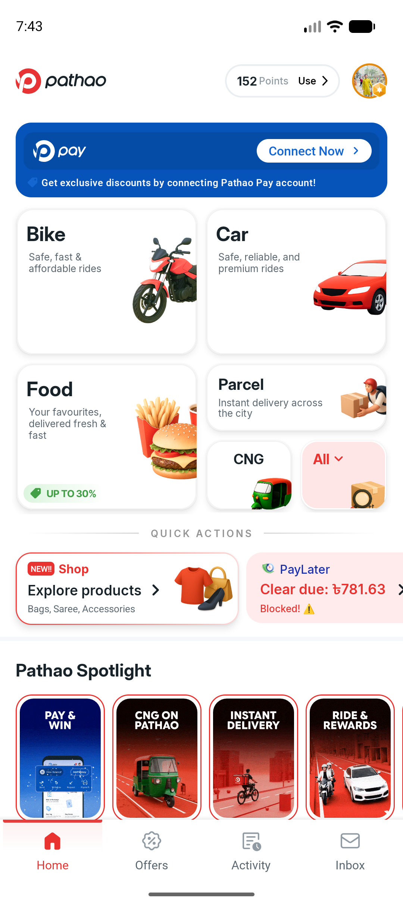

#### 2. Home Screen (Bottom View)
*   **File Name**: `02_home_screen_bottom.png`
*   **Description**: Scrolled bottom section of the Home screen displaying "Quick Actions" (Shop and PayLater status), "Pathao Spotlight" horizontal promo cards, and bottom navigation tabs.
*   **Analysis**: Effective display of contextual cards. The block status for PayLater is visible but uses a bright warning icon to draw attention.
*   **Screenshot**:
    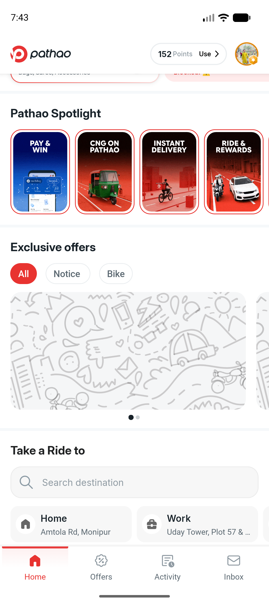

#### 3. All Services Screen (Default & Expanded)
*   **File Names**: `12_all_services_screen.png` & `12_all_services_screen_expanded.png`
*   **Description**: A bottom-sheet catalog triggered by tapping "All" on the Home grid, displaying all services in a detailed double-column layout. Tapping "See More" expands the menu to show additional services like Pharma and Top-Up.
*   **Analysis**: Provides clean separation between ride/logistics categories and digital commerce categories.
*   **Screenshots**:
    ```carousel
    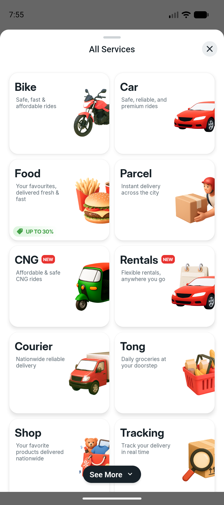
    <!-- slide -->
    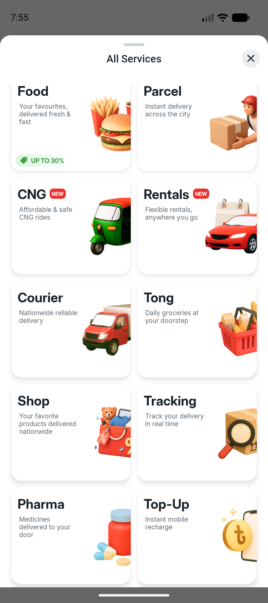
    ```

---

### Core Tab Navigation

#### 4. Offers Screen (Top & Bottom)
*   **File Names**: `03_offers_screen.png` & `03_offers_screen_bottom.png`
*   **Description**: Tabbing into "Offers" opens a promo code and discount card list.
*   **Analysis**: Uses copyable text fields for promotional codes. Promo cards feature red tags to emphasize discount ratios.
*   **Screenshots**:
    ```carousel
    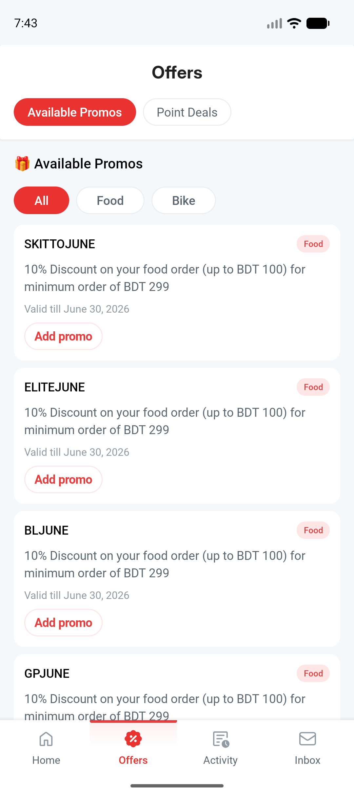
    <!-- slide -->
    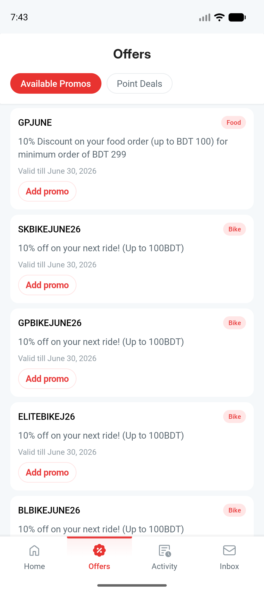
    ```

#### 5. Activity Screen (Top & Bottom)
*   **File Names**: `04_activity_screen.png` & `04_activity_screen_bottom.png`
*   **Description**: Displays booking histories categorized by service type.
*   **Analysis**: Clean chronological log with visual icons denoting transaction success or cancellation status.
*   **Screenshots**:
    ```carousel
    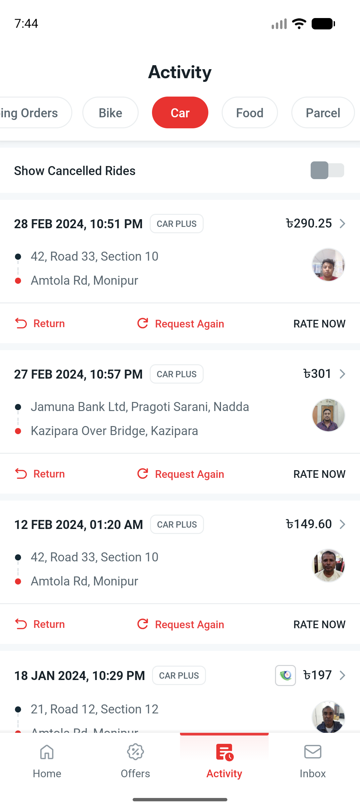
    <!-- slide -->
    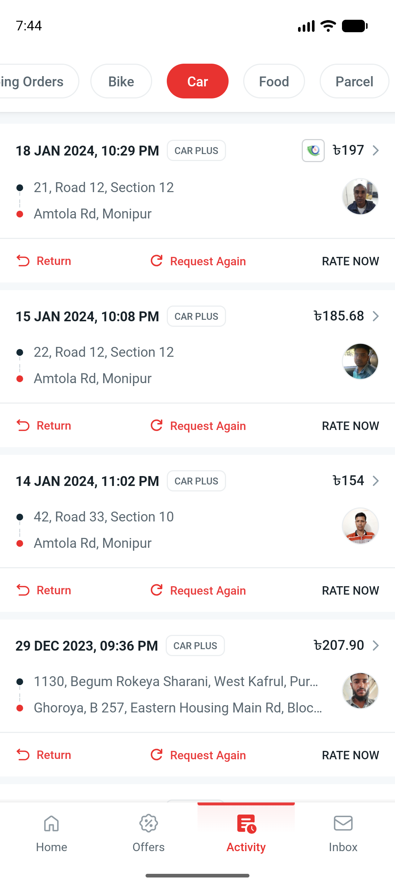
    ```

#### 6. Inbox Screen (Direct & Promotions)
*   **File Names**: `05_inbox_screen.png` & `05_inbox_promotions.png`
*   **Description**: Categorized messages panel divided into "Messages" (empty state) and "Promotions" (discount announcements).
*   **Analysis**: Clean empty states with custom illustrations.
*   **Screenshots**:
    ```carousel
    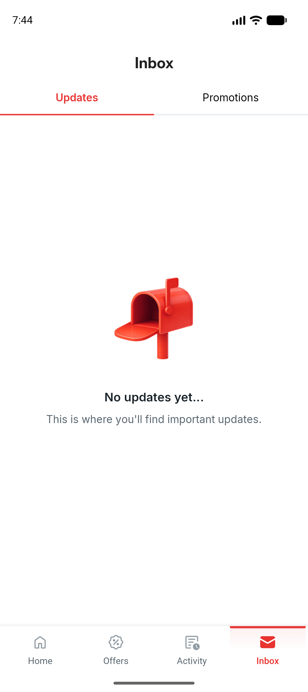
    <!-- slide -->
    
    ```

#### 7. Profile & Settings Screen (Top & Bottom)
*   **File Names**: `06_profile_screen.png` & `06_profile_screen_bottom.png`
*   **Description**: Displays user account profile tier, ratings, active wallet, points balance, and a list of preference settings.
*   **Analysis**: Profile information is grouped nicely with a progression progress bar for loyalty tiers.
*   **Screenshots**:
    ```carousel
    
    <!-- slide -->
    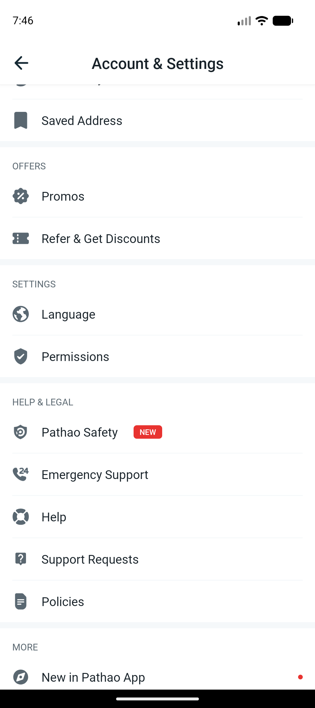
    ```

---

### Ride Booking & Map Flows

#### 8. Ride Selection (Bike, Car, and CNG Booking)
*   **File Names**: `07_bike_booking_screen.png`, `08_car_booking_screen.png`, & `11_cng_booking_screen.png`
*   **Description**: Map interfaces for Ride Booking across different vehicle classes.
*   **Analysis**: High layout consistency. The map interface, search bar placements, and location pins are virtually identical, easing user cognitive load during ride transitions.
*   **Screenshots**:
    ```carousel
    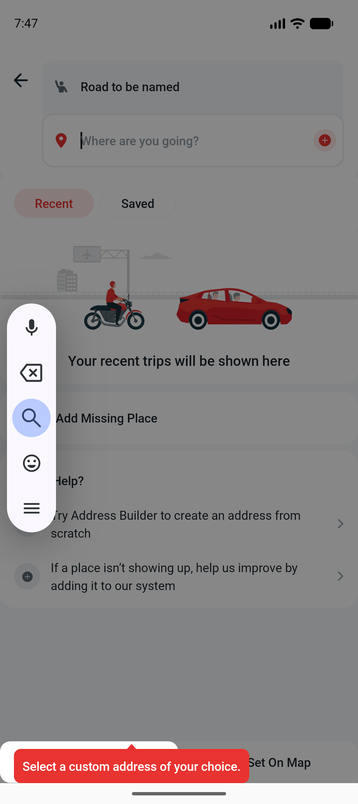
    <!-- slide -->
    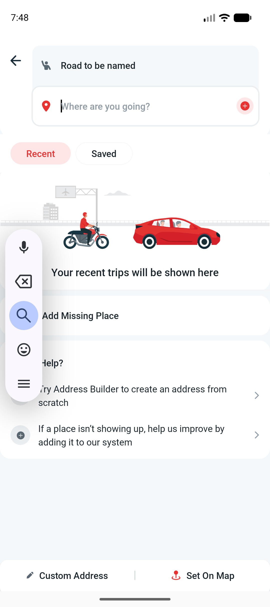
    <!-- slide -->
    
    ```

---

### Onboarding & Value-Added Services

#### 9. Food Main Screen (Empty vs. Populated States)
*   **File Names**: `09_food_main_screen.png`, `09_food_main_screen_home_address.png`, & `09_food_main_screen_home_address_bottom.png`
*   **Description**: Landing page for Pathao Food. It covers the initial out-of-range "No Restaurant Found" empty state, the populated state after choosing a valid "Home" address, and the scrolled view of the food section.
*   **Analysis**:
    *   **Empty State**: Shows a "No Restaurant Found" illustration. It is a dead-end screen with a "Change location" CTA at the very bottom, but lacks inline address recommendations or search support.
    *   **Populated State**: Tapping the address field at the top and selecting "Home" immediately populates the page. The layout uses a horizontal scrollable category bar (Biryani, Indian, Fast Food, Pizza, Burger) with realistic food icons, followed by promo banners ("Delicious Deals", "Tong") and a vertical list of restaurants ("Dhaba - Mirpur", "Rabbani Hotel & Restaurant") containing tags for food genres, ratings, distance, and discounts.
*   **Screenshots**:
    ```carousel
    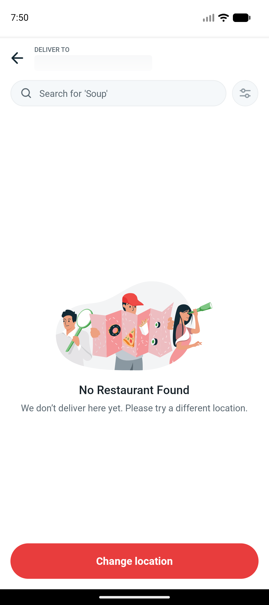
    <!-- slide -->
    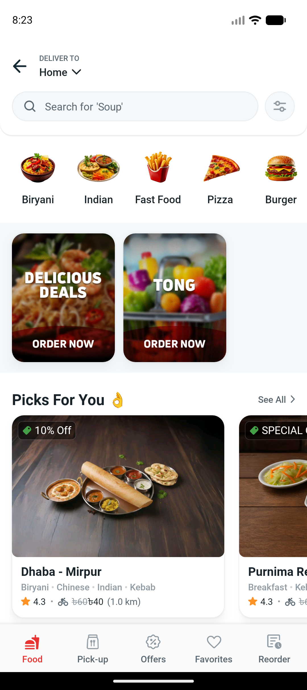
    <!-- slide -->
    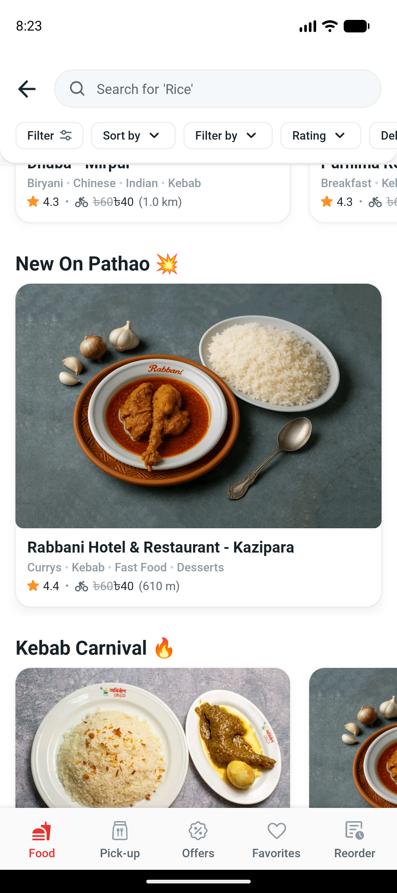
    ```

#### 10. Parcel Onboarding Screen
*   **File Name**: `10_parcel_screen.png`
*   **Description**: Introduces parcel services, emphasizing instant delivery across the city.
*   **Analysis**: Bright illustration and clear primary call-to-action buttons ("Send Parcel" / "Receive Parcel").
*   **Screenshot**:
    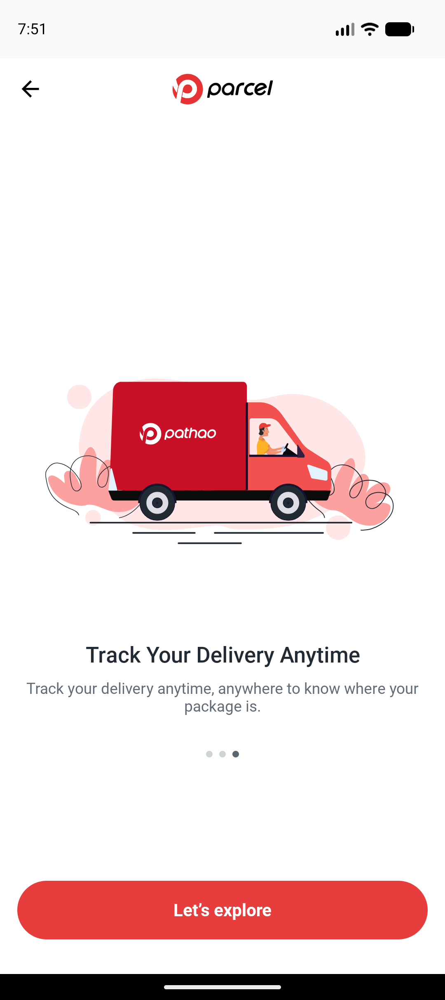

#### 11. Rentals Screen (Top & Bottom View)
*   **File Names**: `14_rentals_screen.png` & `14_rentals_screen_bottom.png`
*   **Description**: Focuses on hourly and long-term car rentals, complete with vehicle class choices and FAQs.
*   **Analysis**: Well-designed service landing page that clarifies rental packages (hourly, airport, intercity).
*   **Screenshots**:
    ```carousel
    
    <!-- slide -->
    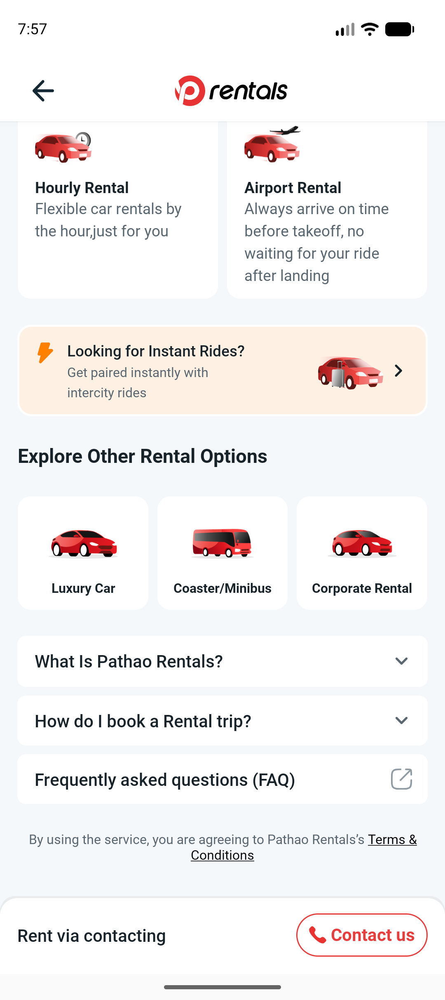
    ```

#### 12. Courier Screen (Top & Bottom View)
*   **File Names**: `15_courier_screen.png`
*   **Description**: Panel for digital merchant courier services, offering options to register a business, send items, or receive packages.
*   **Screenshot**:
    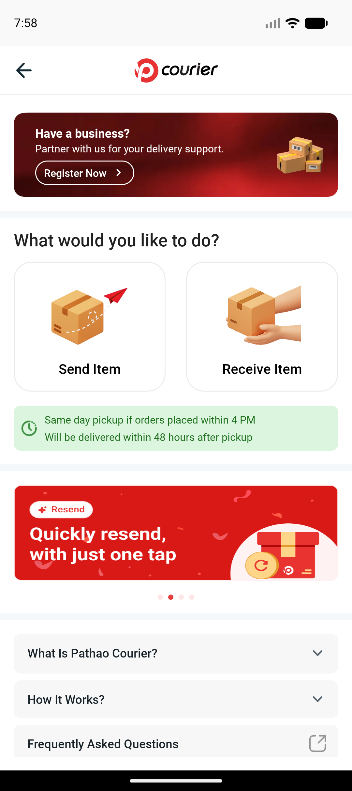

---

### E-Commerce & Shop Flows

#### 13. Pathao Shop (Onboarding, Main Catalog, Scrolled Catalog)
*   **File Names**: `13_shop_intro_screen.png`, `13_shop_screen.png`, & `13_shop_screen_bottom.png`
*   **Description**: The newly introduced Pathao Shop e-commerce platform. Walks user through onboarding values, then shows a vibrant grid of category segments (Fashion, Grocery, Electronics) and horizontal scrolls of promotional products.
*   **Analysis**: The shop interface adopts a modern, clean retail visual hierarchy. Product cards display clear prices, discounts, and high-quality product imagery.
*   **Screenshots**:
    ```carousel
    
    <!-- slide -->
    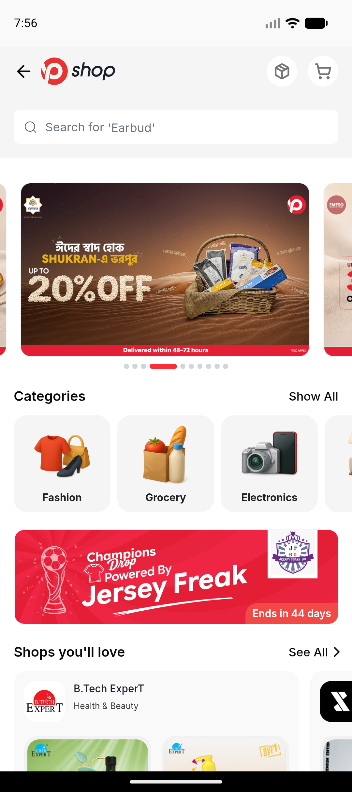
    <!-- slide -->
    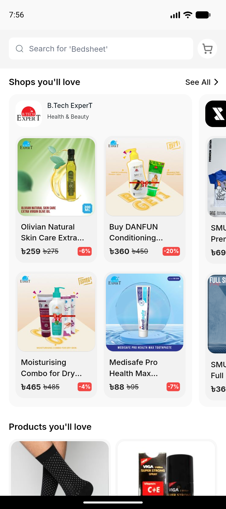
    ```

#### 14. E-Commerce Checkout Flow (Product Details, Customization, Address Form, Confirmed Checkout)
*   **File Names**: 
    - `16_product_details_screen.png` (Product Details View)
    - `17_product_customization_sheet.png` (Product Variant Selector)
    - `18_checkout_screen.png` & `18_checkout_screen_bottom.png` (Initial Checkout View)
    - `21_add_address_sheet.png` & `24_address_sheet_keyboard_hidden.png` (Address Entry Form)
    - `25_area_selector_open.png` (Area Dropdown List)
    - `33_label_toggled.png` (Label Selector and Validated Address Form)
    - `34_checkout_with_address.png` & `35_checkout_receipt_details.png` (Final Checkout & Receipt Breakdown)
*   **Description**: Complete checkout process for a selected retail product ("Olivian Natural Skin Care Extra Virgin Olive Oil 200ml"). Includes variant sheet configuration, address input/validation, local area mapping, shipping fee calculation, and receipt breakdown.
*   **Analysis**:
    - **Product Details & Customization**: Clean, clear product listing. The variant selection sheet slides up smoothly. The "Buy Now" CTA initiates variant selections.
    - **Checkout Flow**: Initial state displays a disabled "Place Order" button due to missing address info. The address setup flow maps coordinates, street addresses, and city dropdown selections. The receipt calculates subtotal, discounts, and shipping charges clearly.
*   **Screenshots**:
    ```carousel
    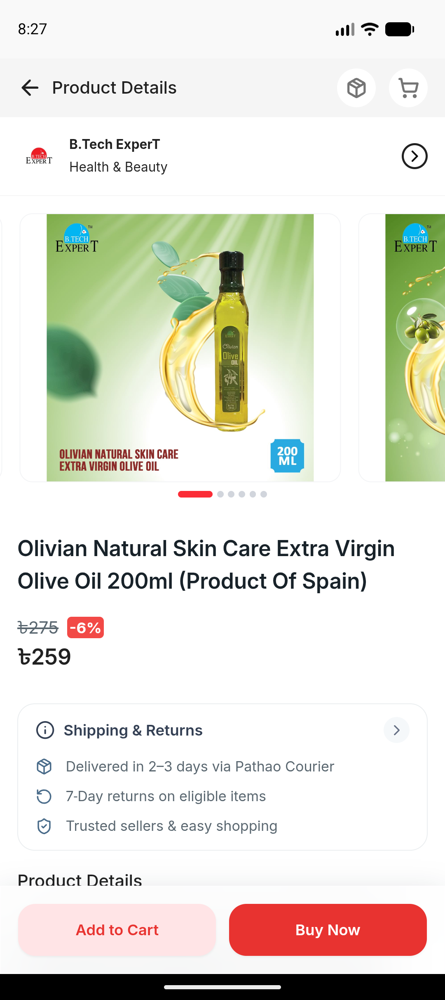
    <!-- slide -->
    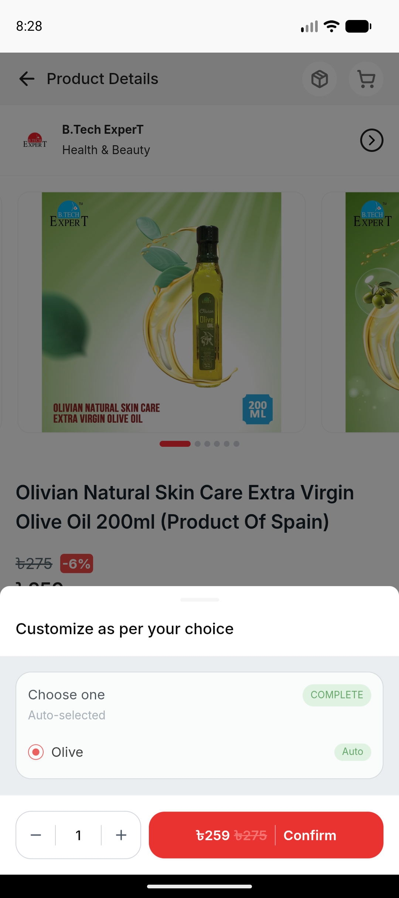
    <!-- slide -->
    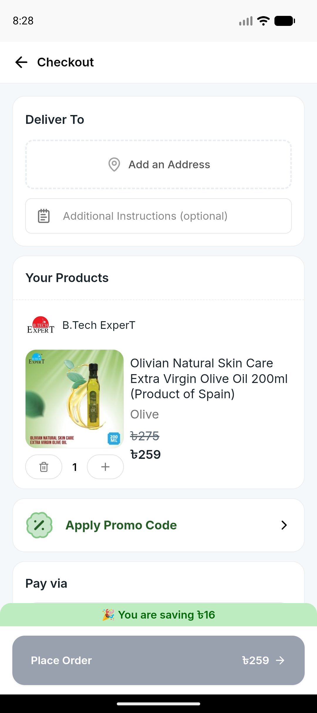
    <!-- slide -->
    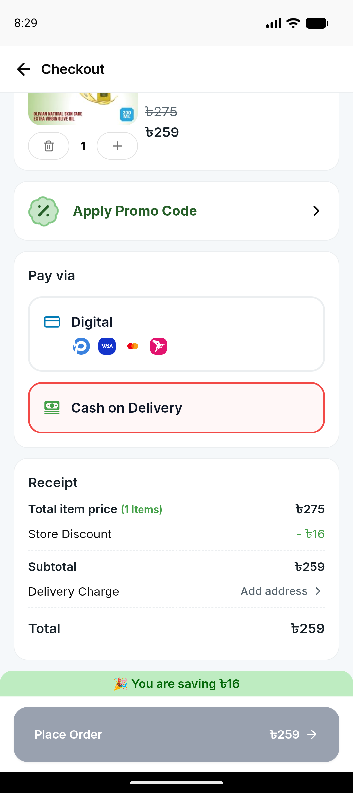
    <!-- slide -->
    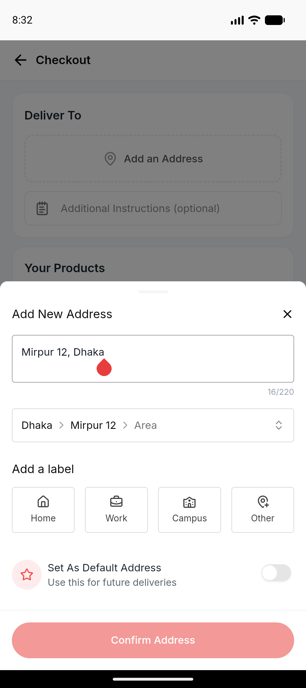
    <!-- slide -->
    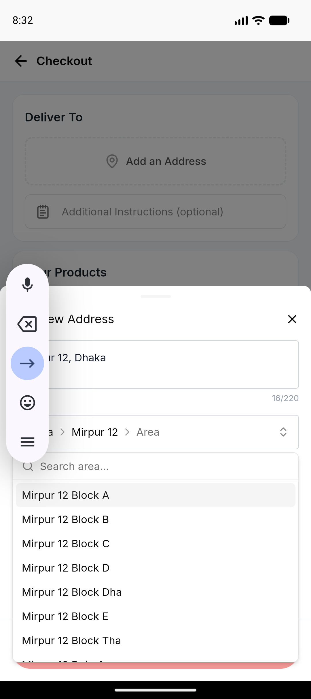
    <!-- slide -->
    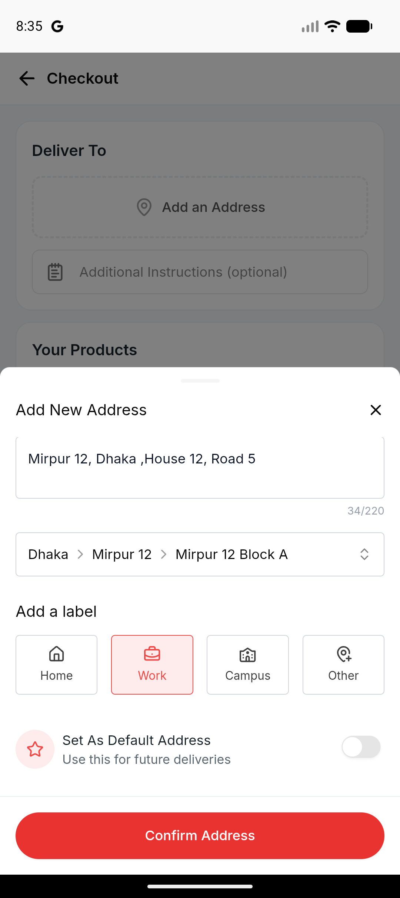
    <!-- slide -->
    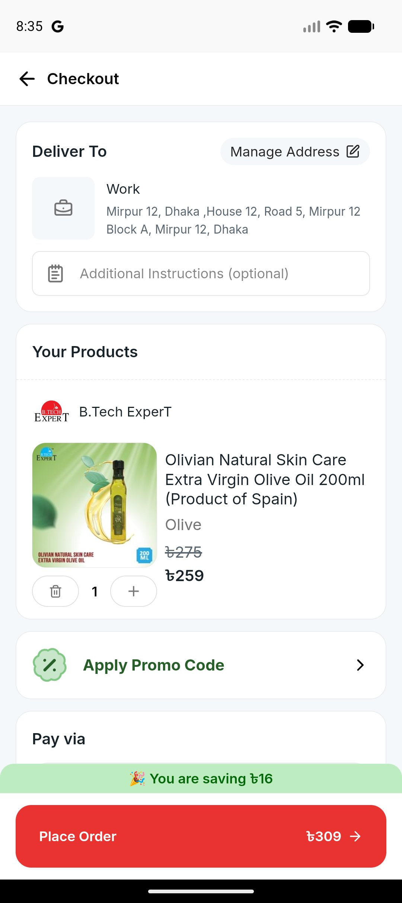
    <!-- slide -->
    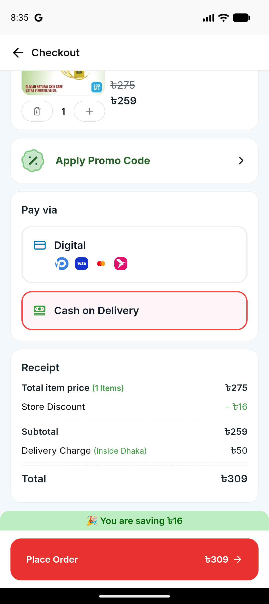
    ```

---

## 3. Heuristic Evaluation & UX Friction Points

### 🚨 Friction Point 1: Intrusive "Pay Later Due" Bottom Sheet Overlay
*   **Issue**: Tapping the back button or returning to the Home dashboard immediately triggers a full-screen blocking modal sheet reminder ("Clear Your Pay Later Due!").
*   **Impact**: Severe disruption of user exploration flows. To dismiss it, users must tap in the far upper screen boundaries (`(500, 200)`), which is hard to reach on modern tall smartphones.
*   **Heuristic violated**: *User control and freedom*.

### ⚠️ Friction Point 2: Redundant Navigation in Ride Selection (Bike vs. Car vs. CNG)
*   **Issue**: Selecting Bike, Car, or CNG from the Home screen routes users to three separate screens that exhibit identical map layouts, search parameters, and interface components.
*   **Impact**: Redundant cognitive load. Users have to pre-decide their vehicle type before seeing map details or availability.
*   **Heuristic violated**: *Consistency and standards*.

### 🔍 Friction Point 3: Poor Address Discovery & Dead-End Food Empty State
*   **Issue**: If the device's current location results in no local restaurants, the Food screen defaults to a static "No Restaurant Found" layout. While setting a preset address (like "Home") from the top address header immediately populates the feed with active restaurants, the app does not nudge the user to switch to a preset or saved address on this empty state screen.
*   **Impact**: Users may assume the service is completely unavailable in their region, rather than realizing it's a coordinate mismatch that can be resolved by switching to their saved "Home" profile address.
*   **Heuristic violated**: *Help users recognize, diagnose, and recover from errors* & *Flexibility and efficiency of use*.

### 🚨 Friction Point 4: Defective Initial Label State in Address Sheet
*   **Issue**: On opening the "Add New Address" sheet, the "Home" label button is visually highlighted in red by default, suggesting it is selected. However, the "Confirm Address" button remains disabled even after a valid address and area are inputted. Tapping "Home" again does not change the state. Only tapping a different label button (like "Work") registers the input correctly with the form validator and enables the confirmation button.
*   **Impact**: Critical UX blocker. Users typing a valid address will find the "Confirm Address" button permanently disabled unless they guess that they must toggle to another address label.
*   **Heuristic violated**: *Error prevention* & *Visibility of system status*.

### ⚠️ Friction Point 5: Screen Displacement & Input Shifting due to Keyboard Toolbar
*   **Issue**: Tapping the Area dropdown automatically pops up Gboard's toolbar on the left. This keyboard activation shifts the entire bottom sheet upwards, changing the vertical position of list items mid-interaction. A user targeting the top item "Mirpur 12 Block A" at the bottom of the screen may accidentally click in the background or select a different item as the dropdown list displaces upwards.
*   **Impact**: Accidental clicks, list closures, and input errors during area mapping.
*   **Heuristic violated**: *Flexibility and efficiency of use*.

---

## 4. Actionable Recommendations

1.  **Refine Modal Overlay Frequency**:
    *   Limit the "Pay Later" popup to trigger only when initiating a booking, rather than on every Home screen visit. 
    *   Introduce a clear "Dismiss" or close button on the modal itself, rather than relying on upper outer-boundary taps.
2.  **Consolidate Ride Booking Map**:
    *   Merge Bike, Car, and CNG entry points into a **unified map view**. 
    *   Allow users to input their destination first, then compare vehicle prices, ETA, and categories in a single bottom sheet, similar to modern global ride-sharing standards.
3.  **Proactive Empty-State Actions**:
    *   Incorporate an active "Change Address" button directly inside the "No Restaurant Found" food landing page.
    *   Offer search suggestions or recommend nearby active areas to help users recover quickly.
4.  **Shop Page Visual Skeleton Loader**:
    *   Shorten the blank/gray skeleton loading phase of the Pathao Shop screen to improve perceived performance.
5.  **Address Form Validator Fix**:
    *   Initialize the address label form field state programmatically to match the visual default ("Home"), or force the user to make an explicit label selection without pre-highlighting any options.
6.  **Keyboard Layout & Focus Management**:
    *   Adjust the scroll container of the address bottom sheet to handle soft keyboard displays gracefully, avoiding layout jumps. Ensure the dropdown list remains anchored to the trigger input rather than shifting dynamically with Gboard toolbar overlays.
