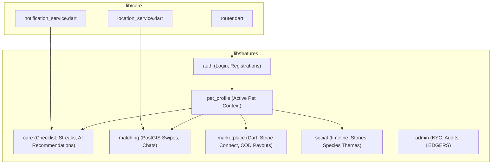

# PetFolio Project Comprehensive System & Architecture Analysis

PetFolio is a premium, multi-tenant mobile ecosystem designed for pet profile management, health tracking, social networking, geospatial matching, and multi-vendor e-commerce. Built with **Flutter**, the application leverages **Riverpod** for robust state management and **Supabase (PostgreSQL)** for secure, real-time backend persistence.

---

## 1. System Architecture Overview

PetFolio is structured using a **Feature-First Architecture** combined with a decoupled core layer. The application enforces a strict separation of concerns through three distinct architectural layers within each feature.

```
lib/
├── core/                         # Shareable Core Infrastructure
│   ├── errors/                   # Application-level Exception Handling
│   ├── models/                   # Canonical Core Models (e.g., Pet)
│   ├── services/                 # Global Services (GPS, Notifications)
│   ├── theme/                    # Color Systems and Typography Themes
│   ├── widgets/                  # Generic UI Components (AppSnackBar)
│   └── router.dart               # Declarative GoRouter Engine & Shell Layout
│
└── features/                     # Feature Modules
    ├── admin/                    # Staff Moderation & Financial Reconciliations
    ├── auth/                     # Supabase Session Management & Reset Handles
    ├── care/                     # Daily Checklist, Streaks & NVIDIA NIM LLM Integration
    ├── marketplace/              # Grouped Cart, Stripe Connect & COD Ledgers
    ├── matching/                 # PostGIS Geospatial Engine, Chat Inbox & Swipes
    ├── pet_profile/              # Onboarding, Active Pet Controller & Switching
    └── social/                   # stories (24h cutoff), Species Themes & Timelines
```

### Architectural Highlights:
* **Feature-First Layout**: All business domains reside in encapsulated subdirectories containing their own data models, repositories, controllers, and views.
* **Declarative Router & Adaptive Shell (`lib/core/router.dart`)**: Uses a central `GoRouter` configuration. It embeds a dynamic shell layout (`AppShell`) that automatically renders a `NavigationRail` on screens broader than 600 dp or an elegant floating bottom pill-bar (`_FloatingNav`) on narrower device viewports.
* **Administrative Interceptors**: Protects critical pathways (e.g. `/admin`, `/seller`) by inspecting session claim payloads on-the-fly (`user.appMetadata['is_admin'] == true`).

---

## 2. Core Functional Modules



### 2.1 Profile Context & Onboarding (`lib/features/pet_profile`)
Acts as the central context provider for the application, establishing the active pet profile that scopes all other network and care interactions.
* **Active Profile Switcher (`active_pet_controller.dart`)**: Manages the currently selected pet profile. On startup, it queries database records and restores the previously active profile key using local `SharedPreferences` mapped by user ID (`active_pet_id_$userId`).
* **Optimistic Reordering (`pet_list_controller.dart`)**: Enables drag-and-drop order updates in the profile switcher. It reorganizes profiles in memory immediately for local responsiveness and updates the backend sequentially. If the update fails, it rolls back to the prior order state automatically.

### 2.2 Health & Care Management (`lib/features/care`)
Tracks daily care schedules, diagnostics, veterinary vaults, streaks, and achievements.
* **Single-RPC Fetch Optimization**: Uses the `get_care_dashboard_snapshot` RPC function to retrieve the entire dashboard dataset in a single network round-trip. This returns care task definitions, current completion states, streaks, week-long progress metrics, and unlocked badges simultaneously, avoiding N+1 database round-trips.
* **NVIDIA NIM LLM Routine Generator (`care_recommendation_service.dart`)**: Employs an LLM query interface (`google/gemma-3n-e4b-it` via NVIDIA NIMs) constrained by a strict JSON schema configuration to generate personalized routine care configurations. It constructs recommendations based on species, breed, age, activity level, recent health logs, and vet vault parameters.
* **Realtime Streak Sync**: Coordinates checking operations with the `check_daily_completion` RPC, which calculates daily streak states in a database transaction and emits real-time updates through `careStreakRealtimeProvider`.

### 2.3 Geospatial Matching & Swiping (`lib/features/matching`)
A playdate discovery module utilizing real-time GPS location parameters and PostGIS database projections.
* **PostGIS Search Engine (`matching_supabase_data_source.dart`)**: Fetches matching candidates via the `matching_discovery_candidates` RPC. This query dynamically evaluates relative distance using PostGIS, applying filtering parameters (species, age, distance radius) while ignoring swiped candidates, owned pets, and private profiles.
* **Double-Opt-In Chat Thread Initializer**: When a mutual swipe is identified in the `swipes` table, the system triggers the `ensure_chat_thread_for_match` RPC to create a mutual messaging channel.

### 2.4 Multi-Vendor Marketplace (`lib/features/marketplace`)
A complex e-commerce engine partitioning catalog items, shopping sessions, and transaction ledgers.
* **Merchant Cart Partitioning (`cart_controller.dart`)**: Groups shopping cart lines by vendor shop ID (`itemsByShop`). This allows the user to review all selected products together but execute checkouts independently per merchant.
* **Connect Onboarding Edge Integration (`shop_repository.dart`)**: Coordinates merchant account setups via the `stripe-onboard-vendor` Edge Function. It registers payment endpoints with Stripe Connect and returns an onboarding URL.
* **Dual Payment Processing (`checkout_controller.dart`)**:
  * **Stripe Connect Sheets**: Creates payment intent keys on the backend, launches the native Stripe Payment Sheet, and polls the backend for confirmation. If the payment webhook is delayed, it switches to a success state with a `verificationPending` flag so the user can continue safely.
  * **Cash on Delivery (COD)**: Bypasses Stripe Payment Sheets, inserting an order in a `pending` status, which is later verified manually by system administrators.
* **Merchant Ledger & Platform Commission**: Records marketplace transactions in `vendor_ledgers`, managing `net_payout_cents` and `platform_fee_cents` alongside payment status categories (`pending_clearance`, `available`, `paid`).

### 2.5 Social networking Feed (`lib/features/social`)
Includes features for sharing stories, comments, likes, and follows.
* **Species-Tailored Aesthetic Palettes (`social_repository.dart`)**: Automatically styles post card templates with deterministic themes based on the pet's species (e.g. Mulberry tones for cats, Meadow greens for rabbits, and Sky blues for dogs) to maintain a cohesive design.
* **Fuzzy Location Scoping**: Displays generalized location names (`fuzzyLocation`) rather than precise coordinates to protect user privacy.
* **Story Cutoffs**: Stories are queried with a strict 24-hour expiration window:
  ```dart
  final cutoff = DateTime.now().subtract(const Duration(hours: 24)).toUtc().toIso8601String();
  ```

### 2.6 Administrative dashboard (`lib/features/admin`)
Provides administrative staff with dashboards for verification, moderation, and manual financial reconciliation.
* **Secure Document Signed URLs**: KYC tax and identity verification documents are stored in a private Supabase Storage bucket. The admin panel accesses these files using short-lived signed URLs (`createSignedUrl(path, 60)`), valid for exactly 60 seconds.
* **COD Reconciliation**: Admin dashboard tools enable manual reconciliation of cash collections for Cash on Delivery orders, updating order records and moving merchant balances from `pending_clearance` to `available` payout states.

---

## 3. High-Performance Engineering Patterns

To ensure high responsiveness and smooth performance on mobile and web viewports, PetFolio implements several optimization patterns:

### 3.1 N+1 Query Prevention
Instead of fetching relational structures sequentially on the client side, PetFolio handles relational joins at the database level using database views and consolidated RPCs.
* **Care Dashboard Snapshot**: Aggregates five query tables into a single transaction query.
* **Social Stats Snapshot**: Resolves total post counts, follower counts, and following counts through a single RPC query (`get_pet_stats`), replacing three parallel SQL count operations.
* **Targeted Social Likes**: Instead of pulling all like records for all posts, the timeline queries only the active pet's like statuses for the visible post IDs in a single round-trip (`_fetchLikedPostIds`).

### 3.2 Optimized Location Handling (`location_service.dart`)
* **Stale Fix Prevention**: Bypasses provider caching for matching queries, accessing the geolocator service directly.
* **OS Cache Acceleration**: Attempts to retrieve the last known location from the OS first for rapid loading. If unavailable, it falls back to a fresh GPS query with a 20-second timeout limit, accommodating slow emulator locks.
* **Silent GPS Fallbacks**: GPS reading errors are handled gracefully. In-app navigation processes are completed uninterrupted, falling back to static pet profile locations instead of blocking the user interface with fatal error dialogs.

### 3.3 Dynamic State Isolation
* Riverpod watchers observe only the key parameters they need to display (e.g. `activePetIdProvider` rather than `activePetControllerProvider`), preventing full-page redraws when localized model properties undergo modification.

---

## 4. Key Database Schema Mappings

The following table summarizes how key database operations map to the codebase:

| Feature | DB Object / Action | Scope & Optimization |
| :--- | :--- | :--- |
| **Auth** | `appMetadata['is_admin']` | Checked dynamically in `isAdminProvider` |
| **Pet List** | `reorderPets` | Serialized individual row updates scoped by RLS |
| **Care Checklist** | `get_care_dashboard_snapshot` RPC | Aggregates tasks, daily logs, streaks, and achievements |
| **Daily Streak** | `check_daily_completion` RPC | Atomic transaction recalculation for logs and streaks |
| **Matching Engine** | `matching_discovery_candidates` RPC | Spatial distance evaluations using PostGIS calculations |
| **Chat Initialization** | `ensure_chat_thread_for_match` RPC | Automatically provisions mutual match thread instances |
| **Marketplace checkout** | `stripe-onboard-vendor` Edge Function | Stripe Connect merchant setups |
| **payouts Ledger** | `vendor_ledgers` | Platforms commissions, clearance tracking, and cash collections |
| **Stories Timeline** | `stories.created_at` cutoff | Expiration checks within a strict 24-hour window |
| **KYC Audit** | `kyc-documents` Storage Bucket | Access secured via 60-second signed URLs |
