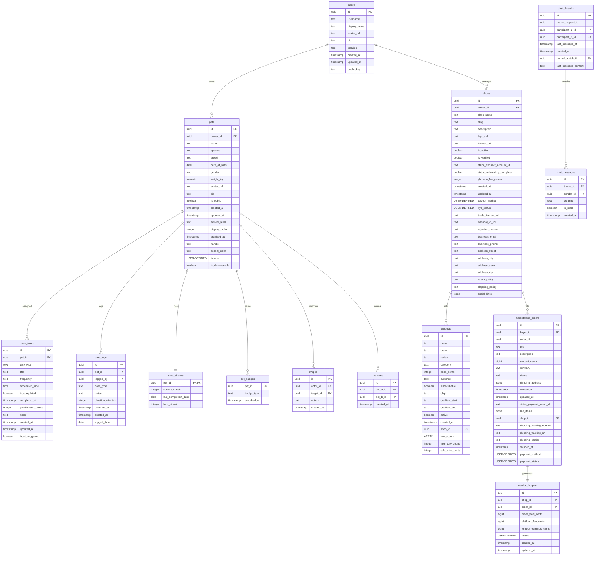

# PetFolio Project: Deep-Dive System, Database Schema & UI/UX Audit

This document presents a comprehensive, multi-layered technical audit of the **PetFolio** platform. The analysis covers the core code structures (`lib/` folder), the relational database schema (Supabase PostgreSQL), and the application's user interface and user experience design system.

---

## 1. System Architecture & Code Design System

PetFolio is built using a **Feature-First Architecture** combined with a layered domain-driven design structure. It segregates logic strictly into presentation, domain, and data layers to isolate concerns, maximize testability, and decouple components.

### 1.1 Structural Organization

```
lib/
├── core/                         # Global Core layer
│   ├── errors/                   # Custom Exception Typologies (AppException)
│   ├── models/                   # Canonical Core Entities (Pet Model)
│   ├── services/                 # Infrastructure Services (Geolocator, Notifications)
│   ├── theme/                    # Design System, Sora & Inter Typeface Tokens
│   ├── widgets/                  # Generic Shared UI Controls (AppSnackBar)
│   └── router.dart               # Core GoRouter Navigation Setup & Adaptive AppShell
│
└── features/                     # Feature Modules
    ├── admin/                    # Staff Moderation & Ledger reconciliations
    ├── auth/                     # Supabase Authentication Streams
    ├── care/                     # Routines Checklist, Streaks & LLM Recommendations
    ├── marketplace/              # Grouped Cart, Stripe Checkout & COD Processing
    ├── matching/                 # PostGIS discovery matching, Swipes & Thread provision
    ├── pet_profile/              # Onboarding, Switching & Context Providers
    └── social/                   # stories (24h), species themes, timelines
```

### 1.2 Declarative Routing & Adaptive AppShell
The routing layout defined in `lib/core/router.dart` uses a customized `GoRouter` architecture:
* **Viewport Adaptivity**: Spacing and navigation structures adjust dynamically according to screen size constraints:
  * **Wide Layout ($\ge 600$ dp)**: Embeds a lateral `_WideNavRail` with high-contrast icon states and text labels.
  * **Compact Layout ($\le 599$ dp)**: Suspends a floating pill-shaped bottom navigation bar (`_FloatingNav`) styled with custom glassmorphism and subtle drop shadows. It sits above the operating system's home indicator using `MediaQuery.paddingOf(context).bottom` adjustments.
* **Declarative Navigation Redirection**: A custom `_RouterNotifier` listens to authentications (`isLoggedInProvider`) and profile registrations (`petListProvider`). This prevents flashing and automatically handles onboarding or auth redirects on cold starts:
  ```dart
  if (!isLoggedIn) {
    return (loc == '/login' || loc == '/register') ? null : '/login';
  }
  ```

---

## 2. Database Schema Analysis (Supabase PostgreSQL)

The backend database runs on PostgreSQL (Supabase). It enforces data integrity through explicit constraints, table relationships, Row Level Security (RLS) policies, database triggers, and PostGIS geographical extensions.

Below is an overview of the table structures based on database schema queries.

### 2.1 Complete Table Matrix



### 2.2 Table Definitions & Column Mappings

1. **`public.users`**: Core user accounts.
   * `id`: `uuid` (Primary Key).
   * `username`: `text` (Not Null).
   * `display_name`: `text` (Default `''`).
   * `avatar_url`, `bio`, `location`: `text` (Nullable).
   * `public_key`: `text` (Used for secure operations).

2. **`public.pets`**: Canonical pet profiles.
   * `id`: `uuid` (Primary Key).
   * `owner_id`: `uuid` (Foreign Key referencing `users.id`).
   * `name`, `species`: `text` (Not Null).
   * `breed`: `text` (Nullable).
   * `date_of_birth`: `date` (Nullable).
   * `gender`: `text` (Default `'unknown'`).
   * `weight_kg`: `numeric` (Nullable).
   * `location`: `geography(Point, 4326)` (PostGIS spatial coordinate).
   * `is_discoverable`: `boolean` (Default `false`).
   * `display_order`: `integer` (Default `0`).
   * `archived_at`: `timestamp with time zone` (Nullable soft-delete).

3. **`public.care_tasks`**: Checklist task definitions.
   * `id`: `uuid` (Primary Key).
   * `pet_id`: `uuid` (Foreign Key referencing `pets.id`).
   * `task_type`: `text` (e.g. `feeding`, `walk`, `grooming`).
   * `frequency`: `text` (e.g. `daily`, `weekly`, `once`).
   * `scheduled_time`: `time without time zone` (Nullable).
   * `gamification_points`: `integer` (Default `10`).
   * `is_completed`: `boolean` (Default `false`).
   * `is_ai_suggested`: `boolean` (Default `false`).

4. **`public.care_logs`**: Chronological log of care tasks.
   * `id`: `uuid` (Primary Key).
   * `pet_id`: `uuid` (Foreign Key referencing `pets.id`).
   * `logged_by`: `uuid` (Foreign Key referencing `users.id`).
   * `care_type`: `text` (Not Null).
   * `logged_date`: `date` (Default `CURRENT_DATE`).
   * `occurred_at`: `timestamp with time zone` (Default `now()`).

5. **`public.care_streaks`**: Real-time streak tracking.
   * `pet_id`: `uuid` (Primary Key, referencing `pets.id`).
   * `current_streak`: `integer` (Default `0`).
   * `last_completion_date`: `date` (Nullable).
   * `best_streak`: `integer` (Default `0`).

6. **`public.shops`**: Merchant account registrations.
   * `id`: `uuid` (Primary Key).
   * `owner_id`: `uuid` (Foreign Key referencing `users.id`).
   * `shop_name`, `slug`: `text` (Not Null).
   * `is_active`: `boolean` (Default `true`).
   * `is_verified`: `boolean` (Default `false`).
   * `stripe_connect_account_id`: `text` (Nullable Connect identifier).
   * `stripe_onboarding_complete`: `boolean` (Default `false`).
   * `kyc_status`: `kyc_status_enum` (Default `'pending'`).
   * `trade_license_url`, `national_id_url`: `text` (Secure files).

7. **`public.marketplace_orders`**: Multi-vendor order entries.
   * `id`: `uuid` (Primary Key).
   * `buyer_id`: `uuid` (Foreign Key referencing `users.id`).
   * `shop_id`: `uuid` (Foreign Key referencing `shops.id`).
   * `amount_cents`: `bigint` (Order total).
   * `payment_method`: `payment_method_enum` (e.g. `'stripe'`, `'cod'`).
   * `payment_status`: `payment_status_enum` (e.g. `'pending'`, `'paid'`, `'collected'`).
   * `status`: `text` (e.g. `'pending'`, `'delivered'`).
   * `line_items`: `jsonb` (Embedded product details).

8. **`public.vendor_ledgers`**: Administrative balances.
   * `id`: `uuid` (Primary Key).
   * `shop_id`: `uuid` (Foreign Key referencing `shops.id`).
   * `order_id`: `uuid` (Foreign Key referencing `marketplace_orders.id`).
   * `order_total_cents`, `platform_fee_cents`, `vendor_earnings_cents`: `bigint`.
   * `status`: `ledger_status_enum` (`'pending_clearance'`, `'available'`, `'paid'`).

---

## 3. UI and UX Design System Audit

The user interface applies modern aesthetic trends such as vibrant accents, high-contrast layouts, smooth gradients, and glassmorphism. It uses custom design tokens to maintain visual consistency.

### 3.1 Design System Tokens & Palette (`lib/core/theme/app_colors.dart`)

The palette avoids default, generic primaries (such as generic gray text or basic blue buttons) in favor of a warm, cream-based design system:

* **Base Canvas**: Light Mode uses a warm cream canvas (`#FFF4E6`), while Dark Mode applies a deep, muted aubergine tone (`#2A1820`).
* **Text Contrast**: Text and icons use warm ink tones (`#261308` in Light Mode, `#FFF1E1` in Dark Mode) instead of standard dark grays or blacks, creating a high-contrast yet organic appearance.
* **Pillar Accent Colors**: Each primary functional module is assigned a distinct thematic color:
  * **Tangerine** (`#FF8A4C`): Used for primary buttons, pet profiles, and onboarding.
  * **Mint** (`#2FCBA0`): Used for health parameters, products, and marketplace checkouts.
  * **Sunny Yellow** (`#FFC53D`): Dedicated to streaks, routines, and task achievements.
  * **Lilac** (`#A98BFF`): Reserved for swipes, discoveries, and mutual matches.
  * **Poppy Red** (`#FF3D3D`): Indicates social feeds, timeline posts, likes, and destructive safety actions.
* **Glassmorphic Fill Layer**: Fills use semi-transparent overlays (`glassFillL` = `0x9EFFFFFF`, `glassFillD` = `0x8C2A1820`) combined with thin borders (`glassRimL` = `0x0F261308`) and backdrops to produce clean blur effects.

### 3.2 Typography Rules (`lib/core/theme/app_theme.dart`)

Typography is configured to maintain a clear visual hierarchy:
* **Headings**: Titles, display numbers, card headers, and navigation bars use **Sora** (Bold/SemiBold, weights `w600` and `w700`). Sora is a geometric sans-serif typeface that gives headings a premium, modern feel.
* **Body**: Descriptions, paragraphs, settings, and messaging threads use **Inter** (Regular/Medium, weights `w400` and `w500`). Inter is highly readable and ensures text remains clear across mobile and desktop screens.
* **Dynamic Sizing Matrix**:
  * `displayLarge`: 36 sp (Sora Bold, height 1.05, letter-spacing -0.5).
  * `headlineMedium`: 20 sp (Sora Bold, height 1.2).
  * `bodyLarge`: 16 sp (Inter Medium, height 1.5).
  * `labelMedium`: 12 sp (Inter SemiBold, height 1.35).

### 3.3 Tactile Borders & Input Styling

* **Soft Corners**: Card containers apply an organic, extra-round corner radius (`PetfolioThemeExtension.radius2xl` = `28.0` dp), creating a friendly, modern appearance.
* **Tactile Inputs**: Text input fields use pill-shaped stadium borders (`radiusPill` = `999.0` dp) with generous internal padding (20 dp horizontal, 14 dp vertical). The fields shift border highlight color smoothly upon focusing.
* **Button Heights**: Standardize action buttons with generous heights to ensure touch-friendly targets:
  * Small: 36 dp, Medium: 44 dp, Large: 52 dp, and Core Daily Walks: 64 dp.
* **Elevation & Shadows**: Avoids standard, harsh black drop shadows. It applies soft, multi-layered shadows tinted with primary warm ink colors (e.g. `shadowE3L` = `0x24261308` with a 28 dp blur radius).

---

## 4. Architectural Implementation & Performance Audits

### 4.1 Care Dashboard: Single-RPC Optimizer
* **Inefficient Path**: Pulling active tasks, daily checklists, streaks, and weekly records would ordinarily require five parallel queries. In mobile environments, this can lead to network congestion, connection latency, and N+1 query bottlenecks.
* **Optimized Solution (`pet_care_repository.dart`)**:
  A single Database RPC `get_care_dashboard_snapshot` executes all queries on the server. The database processes, filters, and packages the tables, returning a structured JSON payload in a single round-trip:
  ```dart
  final raw = await _client.rpc(
    'get_care_dashboard_snapshot',
    params: {
      'p_pet_id': petId,
      'p_selected_date': _fmtYmd(dSel),
      'p_week_start': _fmtYmd(minD),
      'p_week_end': _fmtYmd(maxD),
    },
  );
  ```
  The repository then parses the raw data into in-memory lists for the UI, ensuring the dashboard loads quickly and reliably.

### 4.2 Marketplace: Shop Cart Splitting
* **E-Commerce Partitioning (`cart_controller.dart`)**:
  The cart represents a global state managed via a Riverpod notifier. Catalog products from different shops are grouped dynamically under their respective merchant shop IDs (`shopId`):
  ```dart
  Map<String, List<CartItem>> get itemsByShop {
    final map = <String, List<CartItem>>{};
    for (final item in items) {
      map.putIfAbsent(item.product.shopId, () => []).add(item);
    }
    return map;
  }
  ```
  The user can review their entire shopping list in one view but checkout from individual stores independently. This approach separates Stripe Connect charges, COD ledgers, and delivery routes cleanly by vendor.

### 4.3 Stripe Checkout: Webhook Resilience
* **Delayed Webhook Handling (`checkout_controller.dart`)**:
  When a buyer completes a card payment through the Stripe Payment Sheet, the app must confirm that the Stripe webhook has completed the database update before clearing the cart. If the webhook is delayed, waiting on the main thread would block the user.
  To resolve this, `pollOrderConfirmation` listens for confirmation for up to 15 seconds. If it times out, the app transitions the UI to a success state with a `verificationPending` flag. The cart is cleared locally and the order list invalidates in the background, allowing the user to proceed without interruption while the webhook finishes processing.

### 4.4 Geospatial Matching: PostGIS Optimization
* **Geospatial Processing (`matching_supabase_data_source.dart`)**:
  To protect privacy, candidate locations are queried through the `matching_discovery_candidates` RPC. This query calculates relative distance at the database level using PostGIS geography points, ensuring coordinates are never exposed directly to other clients.
* **Silent GPS Fallback**:
  If Geolocator queries fail or permissions are denied on a device, the discovery flow falls back to the pet's default profile location instead of crashing or showing a generic error dialog, maintaining a smooth user experience.

---

## 5. System Design Checklist & Recommendations

Based on this deep-dive audit, the following architectural recommendations are provided:

* `[x]` **Maintain Warm Ink Theme Contrast**: Always use `AppColors.ink950` / `ink950D` for primary text and titles. Avoid introducing standard pitch blacks (`#000000`) or standard neutral grays (`#808080`) which disrupt the organic, warm design system.
* `[x]` **Strict Stadium Buttons**: Enforce stadium pill-shapes (`StadiumBorder()`) for buttons and chip filters to ensure consistent, touch-friendly UI elements.
* `[x]` **Push Relational Joins to DB**: Avoid executing relational joins in Dart (e.g. matching posts with users, or checkouts with shop records). Always use SQL views or PostgreSQL RPCs to handle joins on the backend, preventing N+1 query performance degradation.
* `[x]` **Wrap auth checks in RLS subselects**: When writing Row Level Security policies, wrap authentication calls in a subselect—such as `(select auth.uid())`—to force PostgreSQL to cache the credential, protecting database performance under load.
* `[x]` **Safe signed storage URLs**: Private document tables (such as tax entries, Trade Licenses, and National IDs) must never expose public URLs. Always retrieve these documents using short-lived signed URLs from Supabase Storage with a maximum lifetime of 60 seconds.
